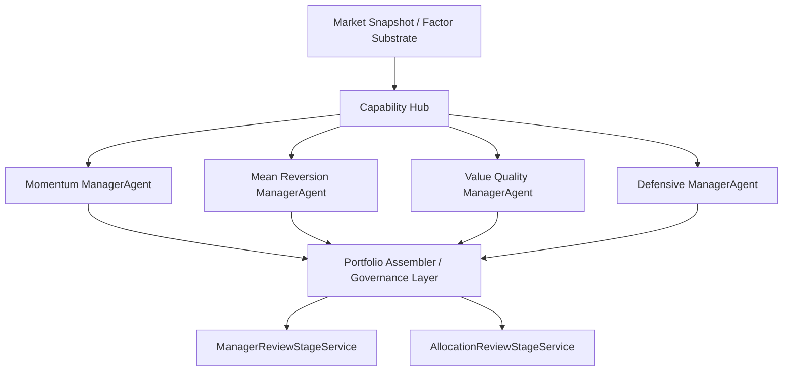

# Agent 交互说明（当前实现）

> 当前系统里的 Agent 设计重点，已经从“会议里谁发言”转到“谁是经理 owner、谁是共享能力、谁负责治理”。

## 0. 当前角色分层

### 0.1 Platform vs Domain 术语对齐

- `Agent Runtime Platform`：平台核心里的 planner、tool loop、memory、presentation、plugin loader。
- `ManagerAgent` / `Capability Hub` / `Governance Layer` / `Cognitive Assist`：投资域里的角色与能力语义。
- `agent_runtime` 不是某个投资经理；它负责把 Commander 的自然语言与工具协议编排成稳定运行时。
- 投资域的 `ManagerAgent` 才是训练链里真正对策略结果负责的 owner。

当前项目里的 Agent / 能力模块主要分成四层：

1. `ManagerAgent`
2. `Capability Hub`
3. `Governance Layer`
4. `Cognitive Assist`

## 1. ManagerAgent

当前主链中的第一责任主体是 `ManagerAgent`，不是 meeting agent。

首批经理来自现有四类风格：

- `Momentum Manager`
- `Mean Reversion Manager`
- `Value Quality Manager`
- `Defensive Manager`

每个经理都应具备：

- `mandate`
- `style_profile`
- `risk_profile`
- `factor preferences`
- `runtime constraints`

经理的核心职责不是自己发明底层能力，而是调用共享底座，产出 `ManagerPlan`。

## 2. Capability Hub

经理不会各自复制执行逻辑。当前系统希望把共享执行能力收编到 `Capability Hub`：

- `ScreeningService`
- `ScoringService`
- `RiskCheckService`
- `PlanAssemblyService`
- `SimulationService`
- `AttributionService`
- `MemoryRetrievalService`

这意味着：

- manager 负责 owner 视角
- capability 负责 executor 视角

## 3. Governance Layer

组合治理不再是“选一个最强模型”，而是：

- 激活经理集合
- 形成 manager budget
- 组装 `PortfolioPlan`
- 做全局风险约束
- 写 manager / allocation leaderboard

这一层的重点对象包括：

- `PortfolioAssembler`
- `ManagerBudgetAllocator`
- `GlobalRiskController`

## 4. Cognitive Assist

认知辅助能力仍然保留，但不再作为私有 agent 树挂在每个经理名下。更合理的形态是共享服务，例如：

- thesis explain
- risk challenge
- failure diagnosis
- upgrade proposal

它们可以使用 LLM，但对 runtime 暴露为统一能力接口。

## 4.1 术语约定

当前仓库里有几类名字容易混淆，这里统一口径：

- `ManagerAgent`
  - 指投资域里的经理 owner
- `Capability Hub`
  - 指共享执行能力，不是新的 owner
- `Cognitive Assist`
  - 指解释、诊断、挑战等认知辅助层
- `/api/agent_prompts`
  - 兼容 API 名称仍然保留，但语义上更接近“角色 prompt / role baseline”配置面

也就是说，`agent_prompts` 这个名字不代表系统重新回到“每个 agent 都是独立应用 owner”的架构。

## 5. 当前主链中的交互方式

当前热路径中的关键约束是：

- manager 先独立产出计划
- governance 再统一组合
- review 再按经理层和分配层拆开

## 6. Legacy Cognitive Adapters

当前公开架构不再把会议模块作为主链对象。

如果在隔离历史资产或历史回归夹具里仍然看到相关实现，应把它们理解为：

- 辅助解释能力
- review 阶段的补充认知工具
- 历史说明资产

补充说明：

- SSE / event payload 里仍可能出现 `meeting_speech`、`meeting` 这类**历史观测字段**。
- 它们当前只表示事件展示或兼容语义，不再表示默认 owner、默认编排器或训练主语。

## 7. 当前最重要的协作原则

### 7.1 经理是 owner

经理负责：

- 在统一上下文下形成自己的投资计划
- 解释自己的计划
- 接受 review 和治理

### 7.2 底座是 executor

共享底座负责：

- 预筛
- 打分
- 风控
- 计划组装
- 仿真
- 归因

### 7.3 治理是统一收口点

治理层负责：

- 把多个经理收束成一个组合
- 记录谁被激活、谁被降权
- 追踪 allocation 是否合理

## 8. 阅读建议

如果你要沿当前实现理解 agent 交互，建议顺序：

1. `src/invest_evolution/investment/managers/`
2. `src/invest_evolution/investment/governance/planning.py`
3. `src/invest_evolution/investment/shared/policy.py`
4. `src/invest_evolution/application/training/controller.py`
5. `src/invest_evolution/application/training/review.py`
6. `src/invest_evolution/application/training/policy.py`
7. `src/invest_evolution/application/training/execution.py`

## 9. Internal Contract Boundary

需要特别避免把“agent 内部能力”误读成“对外 API 面”：

- 对外 public contract 以 `runtime-api-contract.v2`、CLI entrypoints、SSE/API 路由为准。
- `bounded_workflow.v2`、`task_bus.v2`、`task_coverage.v2`、`artifact_taxonomy.v2` 以及它们承载的 `planner`、`recommended_plan`、`used_tools` 等字段，属于 internal runtime/agent contract，不等价于新的 public Web API 面。
- `/api/chat` 与 `/api/chat/stream` 是对外入口；`invest_control_plane_get`、`invest_agent_prompts_update` 这类内部 tool 名称不是外部 deploy contract。
- `/api/agent_prompts` 只是角色 prompt / role baseline 配置入口，不是 `agent_runtime` capability registry。
- Manager / capability / governance 的语义边界需要保持稳定，但不应该通过新增 public route 来表达内部重构。

因此：

- public envelope 可以继续携带内部协议快照，但这不表示 `agent_runtime/planner.py` 的全部内部字段都成为 deploy 兼容承诺。
- agent 编排内部可以继续演化，只要不无意扩大 public Web/API surface。
- 一旦真的要把内部能力外放，必须先提升为显式 contract，再进入 `runtime-api-contract.v2.json` 与 `COMPATIBILITY_SURFACE.md`。
