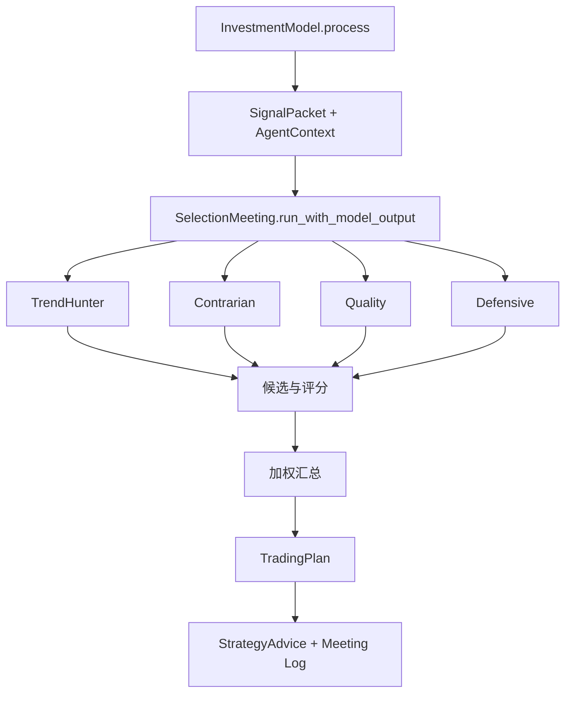
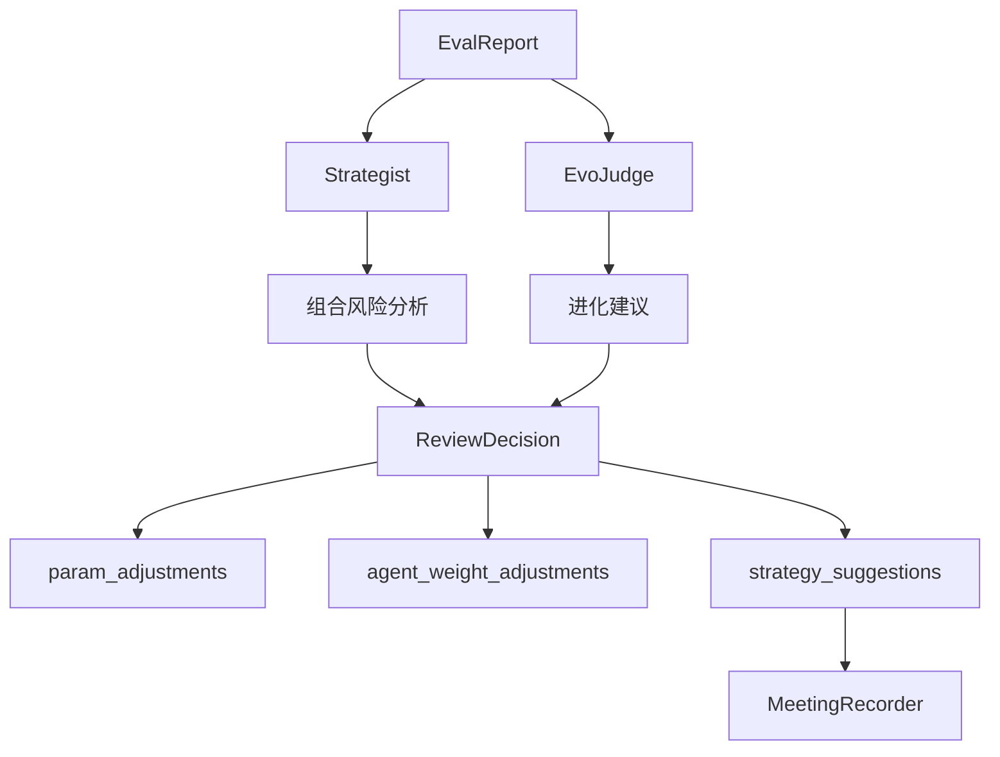

# Agent 交互说明（当前实现）

当前项目里的 Agent 主要分成四层：市场判断、选股猎手、复盘裁判、系统编排。

## 1. 角色总览

### 1.1 市场判断

- `MarketRegimeAgent`
  - 只负责判断 `bull / bear / oscillation`
  - 输出 `confidence` 与 `suggested_exposure`
  - 不负责任何交易执行参数

### 1.2 选股猎手

- `TrendHunterAgent`
  - 偏趋势延续
- `ContrarianAgent`
  - 偏超跌反弹 / 均值回复
- `QualityAgent`
  - 偏质量和稳健约束
- `DefensiveAgent`
  - 偏低波与防御风格

### 1.3 复盘裁判

- `StrategistAgent`
  - 组合层风险分析
- `EvoJudgeAgent`
  - 判断是否应该进化、为什么进化
- `ReviewDecisionAgent`
  - 形成最终复盘建议，并输出参数与权重调整

### 1.4 运行编排

- `Commander`
  - 负责任务编排、状态检查、实验计划与工具调用
  - 不直接扮演单票选股分析师

## 2. 选股会议链路

当前选股会议入口是 `invest/meetings/selection.py` 的 `SelectionMeeting`。

### 2.1 会议输入

- 模型选出的 `selected_codes`
- 股票摘要 `stock_summaries`
- 市场状态与置信度
- 当前模型名 / 配置名
- Agent 权重

### 2.2 会议输出

- `TradingPlan`
- `meeting_log`
- `StrategyAdvice`

### 2.3 会议模式

- 有 LLM：优先走 LLM 会议
- 无 LLM / 不可用：走算法 fallback
- 可选 debate：若启用 debate 且 LLM 可用，会引入额外辩论层

## 3. 复盘会议链路

当前复盘会议入口是 `invest/meetings/review.py` 的 `ReviewMeeting`。

### 3.1 输入事实

- 收益率
- 胜率
- trade history / total trades
- benchmark pass
- sharpe / drawdown / excess return
- selected codes
- 最近 Agent 准确率统计

### 3.2 输出内容

- `strategy_suggestions`
- `param_adjustments`
- `agent_weight_adjustments`
- `reasoning`

### 3.3 复盘后的副作用

- 更新 runtime params
- 更新 `SelectionMeeting` 的 agent weights
- 写 review meeting 工件
- 记录 optimization event（触发源为 `review_meeting`）
- 触发各 Agent 的反思记忆更新

## 4. Agent 边界治理

当前 Agent prompt 与代码共同约束了角色边界：

- `MarketRegime` 不输出交易参数
- Hunter 类 Agent 不输出仓位/止损/现金比例
- `ReviewDecision` 不接管系统编排
- `Commander` 不直接冒充 Hunter 或 ReviewAgent
- 多数 Agent 输出要求为单个 JSON 对象

这些 prompt 当前落在：

- `agent_settings/agents_config.json`

并可通过：

- `/api/agent_prompts`（Prompt 专用；模型绑定走 `/api/control_plane`）

在线修改。

## 5. 会议记录与审计

### 5.1 选股会议

- JSON：`runtime/logs/meetings/selection/meeting_<cycle>.json`
- Markdown：`runtime/logs/meetings/selection/meeting_<cycle>.md`

### 5.2 复盘会议

- JSON：`runtime/logs/meetings/review/review_<cycle>.json`
- Markdown：`runtime/logs/meetings/review/review_<cycle>.md`

### 5.3 周期结果中的引用

周期结果 JSON 里会带上这些工件路径，便于：

- Web Memory detail 回溯
- Training Lab 评估查看
- 人工审计一次训练为什么得出当前结论

## 6. 当前实现的重点特点

### 6.1 不是“所有 Agent 直接交易”

真正驱动交易模拟的是：

- `InvestmentModel` 先产出结构化上下文
- `SelectionMeeting` 再把上下文转成 `TradingPlan`
- `SimulatedTrader` 最终执行交易模拟

### 6.2 复盘永远比优化更靠后

- 亏损达到阈值会触发 optimization
- 但成功周期仍然会进入 review meeting
- review 是每轮训练的标准收尾动作，不是异常补救动作

### 6.3 Agent 权重是可学习的

当前系统支持在 review 后动态调整：

- `trend_hunter`
- `contrarian`
- 其他参与会议的角色权重

这使得会议不是静态 ensemble，而是带反馈回路的协作系统。
