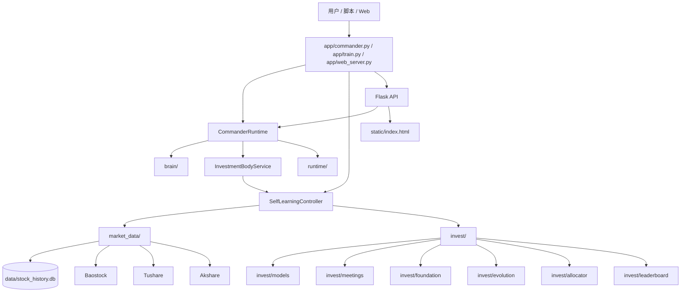
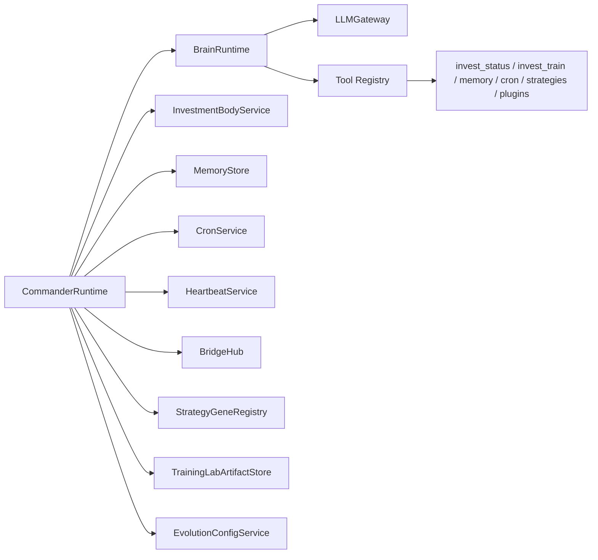
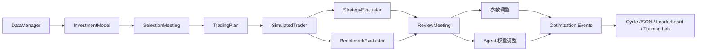
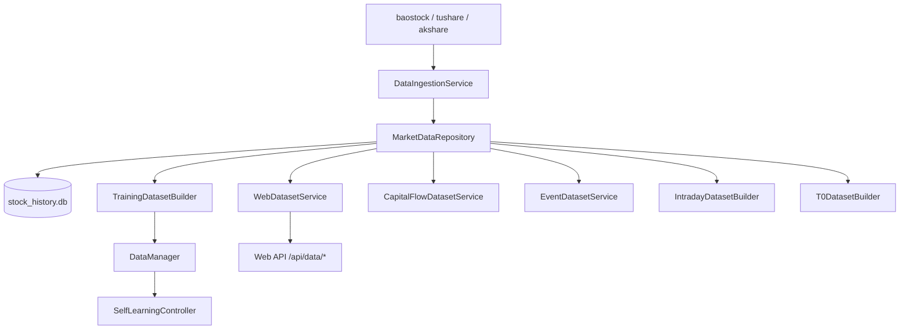

# 架构图（当前代码实现）

## 1. 系统全景图



## 2. Commander 运行时图



## 3. 训练闭环图



## 4. 数据层图



## 5. 运行态工件图

```mermaid
flowchart TD
    TRAIN[训练执行] --> CYCLE[runtime/outputs/training/cycle_*.json]
    TRAIN --> OPT[runtime/outputs/training/optimization_events.jsonl]
    TRAIN --> SEL[runtime/logs/meetings/selection/*.json|md]
    TRAIN --> REV[runtime/logs/meetings/review/*.json|md]
    TRAIN --> SNAP[runtime/state/config_snapshots/*]
    TRAIN --> LAB1[runtime/state/training_plans/*]
    TRAIN --> LAB2[runtime/state/training_runs/*]
    TRAIN --> LAB3[runtime/state/training_evals/*]
    TRAIN --> BOARD[runtime/outputs/leaderboard.json]
    CMD[CommanderRuntime] --> STATE[runtime/outputs/commander/state.json]
    CMD --> MEM[runtime/memory/commander_memory.jsonl]
```

## 6. 设计要点

### 6.1 单进程融合

当前系统不是“Web 一套、训练一套、Agent 一套”的三套运行时，而是：

- Commander 把 Brain 与 Invest Body 融在一个进程里
- Web 只是复用 CommanderRuntime
- 训练入口则直接复用训练控制器

### 6.2 读写分层

- 写数据统一走 `market_data/ingestion.py`
- 读数据统一走 dataset builder / service
- 训练与 Web 都不应直接拼 SQL

### 6.3 审计优先

以下信息都能落盘追溯：

- 周期结果
- 会议记录
- 优化事件
- 配置快照
- 训练计划 / 运行 / 评估
- Commander memory
