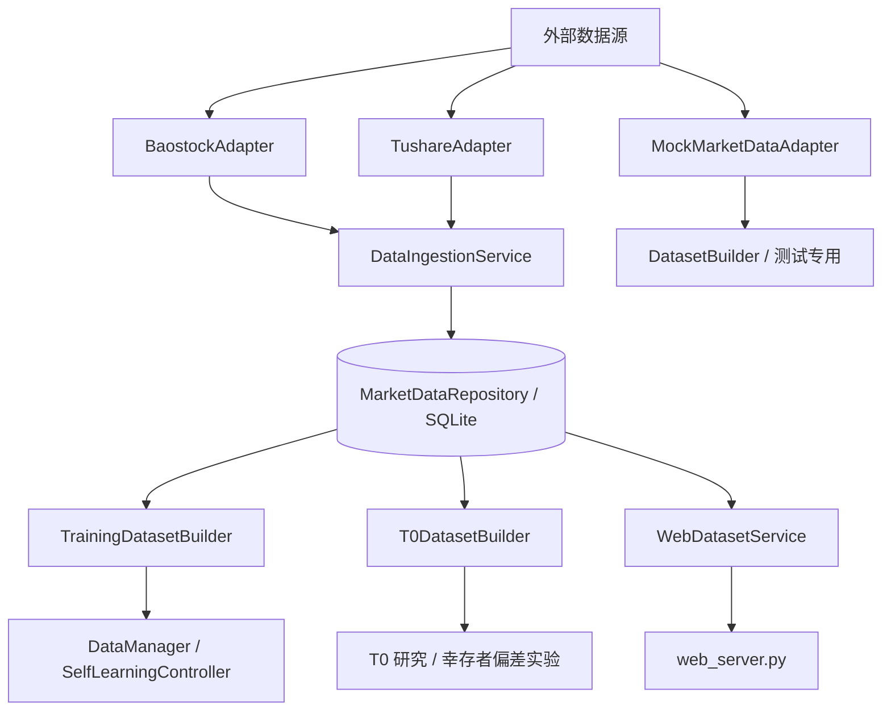

# 数据层统一重构计划（已执行归档）

> 本计划已于 2026-03-07 执行完成，归档结果见 `docs/DATA_LAYER_UNIFICATION_REPORT.md`。

本计划用于将当前项目中并存的两套数据链路统一为一套可维护、可扩展、可测试的数据中台。

## 1. 问题定义

当前项目的数据环节存在以下结构性问题：

1. 同一个数据库文件 `data/stock_history.db` 中存在两套表模型
   - Web / 数据管理链路：`stock_info`、`daily_kline`、`financial_data`
   - 训练 / 回测链路：`stock_daily`、`metadata`
2. 数据下载与数据集构造逻辑耦合在同一个 `data.py` 中，职责过重
3. Web API 与训练主链路实际不共享同一套 canonical schema
4. 在线兜底、离线加载、T0 幸存者偏差修正、mock 数据生成并存，但边界未明确
5. 数据清洗规则分散在多个类中，难以形成统一约束

## 2. 重构目标

本次重构目标：

- 保留一个数据库文件，但统一为一套 canonical schema
- 将“数据接入/下载”和“数据集构造/读取”拆成两层
- 让 Web、训练、T0 研究都从同一仓储层读数据
- 将清洗规则前移并显式化，避免重复实现
- 保持训练逻辑和 Web 功能可逐步迁移，不一次性推翻

## 3. 目标架构

### 3.1 分层

建议拆成以下四层：

1. `adapters/`：外部数据源适配层
   - `BaostockAdapter`
   - `TushareAdapter`
   - `MockMarketDataAdapter`

2. `repository/`：统一仓储层
   - `MarketDataRepository`
   - 唯一负责 SQLite 建表、写入、查询、索引维护

3. `datasets/`：数据集构造层
   - `TrainingDatasetBuilder`
   - `T0DatasetBuilder`
   - `WebDatasetService`

4. `services/`：应用服务层
   - `DataIngestionService`
   - `DataQualityService`
   - `DataManager` 退化为 façade，而非承担全部逻辑

### 3.2 目标数据流

## 4. Canonical Schema 设计

建议统一为以下表：

### 4.1 `security_master`

字段：
- `code` 主键
- `name`
- `list_date`
- `delist_date`
- `industry`
- `is_st`
- `source`
- `updated_at`

作用：
- 替代当前 `stock_info`
- 为训练、Web、T0 股票池构造提供同一股票主数据

### 4.2 `daily_bar`

字段：
- `code`
- `trade_date`
- `open`
- `high`
- `low`
- `close`
- `volume`
- `amount`
- `pct_chg`
- `turnover`
- `adj_flag`
- `source`
- `updated_at`

唯一键：
- `(code, trade_date, adj_flag)` 或 `(code, trade_date)`（若只保留一种复权口径）

作用：
- 替代 `daily_kline` 与 `stock_daily`
- 训练与 Web 使用同一行情表

### 4.3 `financial_snapshot`

字段：
- `code`
- `report_date`
- `publish_date`
- `roe`
- `net_profit`
- `revenue`
- `total_assets`
- `market_cap`
- `source`
- `updated_at`

作用：
- 延续当前 `financial_data` 的职责

### 4.4 `ingestion_meta`

字段：
- `key`
- `value`
- `updated_at`

作用：
- 记录同步时间、最新交易日、数据源状态、版本信息等
- 替代/吸收当前 `metadata`

### 4.5 可选：`universe_snapshot`

字段：
- `snapshot_date`
- `code`
- `is_listed`
- `is_delisted`
- `is_st`

作用：
- 如果 T0 研究进一步深化，可以把某时点股票池落盘，减少运行时重复构造

## 5. 统一清洗规则

以下规则必须从“分散实现”提升为“统一规范”：

### 5.1 标准化规则
- 日期统一为 `YYYYMMDD`
- 代码统一为 `sh.600000` / `sz.000001` 风格
- 数值列统一使用 `float`，非法值转为 `NULL`
- 所有行情记录按 `code, trade_date` 排序存储

### 5.2 股票池规则
- 仅保留 A 股主板 / 创业板：`sh.6`、`sz.00`、`sz.30`
- `is_st` 在主数据层统一标记，不在下游重复判断
- 上市/退市信息只在主数据层维护

### 5.3 训练数据规则
- 训练集构造必须显式传入 `cutoff_date`
- 默认只返回 `trade_date <= cutoff_date`
- 若需要未来窗口，只能通过 `include_future_days` 显式扩展
- 必须按 `min_history_days` 过滤历史长度不足的股票

### 5.4 T0 规则
- T0 股票池基于 `security_master.list_date/delist_date`
- 幸存者偏差修正逻辑集中在 `T0DatasetBuilder`
- T0 逻辑不应散落在普通训练 loader 中

## 6. 模块拆分方案

建议将当前 `data.py` 拆为：

- `data/adapters.py`
  - `BaostockAdapter`
  - `TushareAdapter`
  - `MockMarketDataAdapter`

- `data/repository.py`
  - `MarketDataRepository`
  - schema 初始化、upsert、查询方法

- `data/ingestion.py`
  - `DataIngestionService`
  - 批量同步股票主数据、行情、财务数据

- `data/datasets.py`
  - `TrainingDatasetBuilder`
  - `T0DatasetBuilder`
  - `WebDatasetService`

- `data/quality.py`
  - `DataQualityService`
  - 数据覆盖率、缺失率、异常值、日期断档巡检

- `data/manager.py`
  - `DataManager`（兼容外部调用入口，但内部只做编排）

## 7. 分阶段迁移计划

### Phase 0：基线确认

目标：在动数据层前先锁定当前行为。

任务：
- 为当前 `DataManager.load_stock_data()`、`web_server /api/data/*`、`T0DataLoader.load_data_at_t0()` 增加行为快照测试
- 统计当前数据库中的表结构、样例数据与调用路径
- 输出字段映射表：`daily_kline -> daily_bar`、`stock_daily -> daily_bar`

产出：
- 行为基线测试
- 字段映射清单
- 当前调用点清单

回滚点：
- 不改业务实现，仅新增测试和文档

### Phase 1：建立统一仓储层

目标：先建 canonical schema，不立即替换旧链路。

任务：
- 新建 `MarketDataRepository`
- 创建 `security_master` / `daily_bar` / `financial_snapshot` / `ingestion_meta`
- 为 repository 增加 `upsert_security_master()`、`upsert_daily_bars()`、`query_daily_bars()` 等接口

产出：
- 新仓储层代码
- 仓储层测试

回滚点：
- 老代码仍可继续使用，仓储层仅并行存在

### Phase 2：统一下载写入入口

目标：让所有下载动作都先写 canonical schema。

任务：
- 将 `DataCache.download_stock_info()` 迁移到 `DataIngestionService.sync_security_master()`
- 将 `DataCache.download_daily_kline()` 与 `DataDownloader.download_all()` 迁移到统一的 `sync_daily_bars()`
- 所有 source adapter 只负责“拉原始数据”，不直接写 DB

产出：
- 新 ingestion service
- Web `/api/data/download` 改为调用统一 service

回滚点：
- 保留旧表只读，不再继续写新数据

### Phase 3：统一读取路径

目标：训练和 Web 都从 canonical schema 读。

任务：
- 用 `TrainingDatasetBuilder` 取代 `OfflineDataLoader.get_stocks()`
- 用 `WebDatasetService` 取代 `DataCache.get_status_summary()` / 局部查询逻辑
- `DataManager` 改为只编排 `TrainingDatasetBuilder`、在线 adapter 和 mock adapter

产出：
- 新 dataset builders
- 更新 `train.py` 与 `web_server.py` 调用路径

回滚点：
- 旧 loader 保留只读实现，未删除前可快速切回

### Phase 4：迁移 T0 研究链路

目标：把幸存者偏差修正逻辑统一纳入 dataset builder。

任务：
- 用 `T0DatasetBuilder` 取代 `HistoricalStockPool + T0DataLoader` 的分散实现
- 若需要，加入 `universe_snapshot` 表以缓存历史股票池

产出：
- 新 T0 数据集构造器
- T0 行为测试

回滚点：
- 保留原 T0 loader 到 Phase 5 再删除

### Phase 5：删除旧表与旧类

目标：完成收口。

任务：
- 删除 `daily_kline` / `stock_daily` 二元并存设计
- 删除 `DataCache`、`OfflineDataLoader`、`DataDownloader` 中已被替代的实现
- 只保留 adapter / repository / datasets / manager 新结构

产出：
- 统一数据层
- 删除遗留逻辑

回滚点：
- 在 Phase 5 前做一次数据库备份与 Git tag

## 8. 文件级改造清单

### 必改文件
- `data.py`：逐步拆解，最终缩减为 façade 或删除
- `train.py`：切换到新的 `DataManager` / `TrainingDatasetBuilder`
- `web_server.py`：切换到新的 `DataIngestionService` / `WebDatasetService`
- `README.md`：更新数据下载与初始化说明
- `docs/ARCHITECTURE_DIAGRAM.md`：更新数据层结构图
- `docs/MAIN_FLOW.md`：更新主链路中的数据部分

### 新增文件建议
- `data/adapters.py`
- `data/repository.py`
- `data/ingestion.py`
- `data/datasets.py`
- `data/quality.py`
- `docs/DATA_LAYER_UNIFICATION_REPORT.md`（最终归档）

## 9. 测试策略

### 9.1 单元测试
- repository 的 upsert/query
- schema 初始化
- 字段映射与日期标准化
- dataset builder 的 cutoff / min_history_days / include_future_days 规则

### 9.2 集成测试
- `web_server` 数据接口能读到统一 schema
- `DataManager.load_stock_data()` 返回结构与训练控制器兼容
- T0 数据集构造能够修正幸存者偏差

### 9.3 迁移测试
- 在旧库上运行迁移后，训练与 Web 至少可读
- 从旧表导入新表的记录数、日期覆盖范围、股票数一致性检查

## 10. Agent 是否参与

结论：

- **不建议 agent 参与底层数据获取、清洗、落库、训练数据裁切**
- **建议 agent 参与数据质量巡检、异常解释、同步建议与运维问答**

### 不建议 agent 参与的部分
- 数据源下载
- 字段标准化
- T0 截断规则
- 幸存者偏差修正
- 最小历史长度过滤

原因：
- 这些环节必须 deterministic、可复现、可审计
- agent 参与会增加隐式判断与不可重复性

### 适合 agent 参与的部分
- 数据质量报告生成
- 数据异常归因与修复建议
- 数据覆盖率/最新日期/失败批次的解释
- 前端问答层（例如“当前离线库覆盖到哪天？”）

### 建议落地方式
- 新增 `DataQualityService` 先产出结构化诊断结果
- agent 只消费诊断结果并生成解释文本
- agent 不直接修改数据库、不直接决定清洗规则

## 11. 建议的执行顺序

建议按以下顺序实施：

1. Phase 0：行为基线 + 字段映射
2. Phase 1：统一仓储层
3. Phase 2：统一下载写入入口
4. Phase 3：统一读取路径
5. Phase 4：统一 T0 链路
6. Phase 5：删除旧结构并归档

## 12. 本计划的判断

这是一个适合“渐进式迁移”的重构，而不是一次性重写。

推荐策略：
- **先并行新结构**，不要马上删旧链路
- **先统一 schema，再统一调用点**
- **先锁定训练链路，再回收 Web 链路**
- **先 deterministic 化，再考虑 agent 化**
