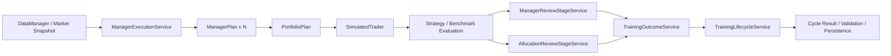

# 主链路说明（以当前实现为准）

> 当前仓库的训练主链，已经以“多经理运行 + 组合治理 + 双层复盘”为默认目标结构。  
> 旧会议对象只保留在归档材料中，不再参与当前默认主链编排。

本文描述当前代码的主入口和真正生效的训练闭环，对应实现主要在：

- `src/invest_evolution/application/commander_main.py`
- `src/invest_evolution/application/train.py`
- `src/invest_evolution/application/training/bootstrap.py`
- `src/invest_evolution/application/training/controller.py`
- `src/invest_evolution/application/training/execution.py`
- `src/invest_evolution/application/training/review.py`
- `src/invest_evolution/application/training/policy.py`
- `src/invest_evolution/application/training/research.py`
- `src/invest_evolution/application/training/persistence.py`
- `src/invest_evolution/application/training/observability.py`

## 0. 系统性质

当前系统不是“单模型回测脚本”，而是一个带治理语义的多经理训练运行时：

- `SelfLearningController` 负责训练 orchestration。
- `ManagerExecutionService` 负责同周期内多经理计划生成。
- `PortfolioPlan` 是组合层的唯一事实主对象。
- `ManagerReviewStageService` 和 `AllocationReviewStageService` 负责双层复盘。
- `TrainingOutcomeService` / `TrainingPolicyService` / `TrainingPersistenceService` 负责把 manager-aware / portfolio-aware 结果沉淀为统一工件。

## 1. 三个正式入口

### 1.1 Commander 入口

`src/invest_evolution/application/commander_main.py` 是统一控制面 facade，内部装配与动作编排已经收口到：

- `commander_main.py`：保留 `CommanderConfig`、`CommanderRuntime`、`main`
- `commander/bootstrap.py`：runtime bootstrap、路径同步、配置 wiring
- `commander/runtime.py`：运行时装配与生命周期协调
- `commander/status.py`：状态/诊断读侧聚合
- `commander/workflow.py`：ask / train-once / playbook reload / plugin reload / cron orchestration 与 mutating / readonly workflow
- `commander/ops.py`：治理、配置、数据与控制面操作

### 1.2 训练入口

`src/invest_evolution/application/train.py` 是训练 facade，保留 `SelfLearningController`、`TrainingResult`、`train_main`，入口层细节当前收口为：

- `training/bootstrap.py`：controller 依赖装配、readiness / mock provider / 默认诊断 payload、config/runtime wiring
- `training/controller.py`：训练生命周期与主 orchestration
- `training/execution.py`：经理执行、选股、模拟、promotion / lineage / outcome 主链
- `training/review.py`：review 输入归一化与 review service
- `training/review_contracts/__init__.py`：阶段 contracts、envelopes、TypedDict payload 与 snapshot / projection builders
- `training/policy.py`：实验协议、治理范围、运行参数与策略归一化

`train.py` 暴露 `SelfLearningController`，用于：

- 单轮训练
- 连续训练
- mock / smoke 验证
- 训练闭环与治理链调试

补充约定：

- `train.py` 对外仍是正式 facade，但当前定位为**批处理 / 自动化兼容入口**。
- 人类日常交互统一优先走 `Commander`，避免主入口再次分叉。

### 1.3 Web 入口

`src/invest_evolution/interfaces/web/server.py` 提供：

- 训练状态与事件流
- Training Lab 计划 / 执行 / 评估
- runtime 配置面

Web 入口当前定位为：

- 无状态 API / SSE / deploy surface
- 机器读写与可视化观察面
- 非推荐人类主入口

### 1.4 Platform-Core 与 Investment-Domain 边界

为避免后续继续把“平台能力”和“投资场景逻辑”揉回一层，当前约定按两层理解仓库：

- `platform-core`
  - `application/commander/*`
  - `interfaces/web/*`
  - `agent_runtime/*`
  - `config/control_plane.py`
  - 负责入口、控制面、SSE、配置治理、bounded tool orchestration
- `investment-domain`
  - `application/train.py`
  - `application/training/*`
  - `investment/*`
  - `market_data/*`
  - 负责训练协议、经理体系、组合治理、研究与市场数据

边界规则：

- platform-core 不直接拥有投资经理策略语义
- investment-domain 不反向拥有 deploy / Web / config mutation surface
- 若未来做场景泛化，应优先复用 platform-core，而不是把投资术语抬升成全局平台术语

## 2. 当前训练主链

这条链路的核心变化是：

- 选择阶段的主事实已经从 `manager_output -> TradingPlan` 迁移为 `manager_results -> PortfolioPlan`
- review 阶段的主事实已经从单一 `EvalReport` 迁移为“经理复盘 + 组合复盘”
- 周期结果、生命周期事件、落盘工件都以 manager/portfolio 主语展开

## 3. 训练主对象

### 3.1 经理运行对象

- `ManagerRunContext`
- `ManagerPlan`
- `ManagerResult`
- `ManagerAttribution`

### 3.2 组合治理对象

- `PortfolioPlan`
- `portfolio_attribution`
- `dominant_manager_id`
- `active_manager_ids`
- `manager_budget_weights`

### 3.3 复盘与治理对象

- `manager_review_report`（persisted digest）
- `allocation_review_report`（persisted digest）
- `run_context`
- `promotion_record`
- `lineage_record`

## 4. 当前默认训练闭环

### 4.1 数据与市场状态

训练周期先准备统一 market snapshot：

- 训练截断日
- 股票历史数据
- governance / regime 上下文
- runtime params

### 4.2 多经理计划生成

`ManagerExecutionService` 在同一 market snapshot 下并行生成多个 `ManagerPlan`：

- `momentum`
- `mean_reversion`
- `value_quality`
- `defensive_low_vol`

每个经理都会产出：

- 自己的持仓计划
- 自己的 selected codes
- 自己的 attribution

### 4.3 组合计划生成

经理结果进入组合层后，生成统一 `PortfolioPlan`：

- 合并 manager sleeves
- 处理重复持仓
- 形成 active manager set
- 生成最终组合持仓与现金比例

### 4.4 模拟与评估

`SimulatedTrader` 对 `PortfolioPlan` 进行模拟执行，并写出：

- 收益率
- 交易记录
- 策略评分
- benchmark 指标

### 4.5 双层复盘

当前 review 不再只回答“这个模型是否要调参数”，而是拆成两层：

- `ManagerReviewStageService`
  - 看经理是否产出空计划
  - 看经理是否与当前 regime 匹配
  - 看经理是否需要观察、降权、继续运行
- `AllocationReviewStageService`
  - 看预算分配是否合理
  - 看组合是否过度集中
  - 看 portfolio assembly 是否引入不合理暴露

历史 review 会议模块若仍出现在隔离历史资产中，也只应被视为复盘阶段的旧认知辅助，不再承担当前控制器级 owner 身份。

### 4.6 结果沉淀

`TrainingOutcomeService` 统一构建周期结果，显式包含：

- `manager_results`
- `portfolio_plan`
- `portfolio_attribution`
- `manager_review_report`
- `allocation_review_report`
- `execution_snapshot`
- `run_context`
- `review_decision`
- `similarity_summary`
- `contract_stage_snapshots`
- `validation_report`
- `validation_summary`
- `dominant_manager_id`
- `execution_defaults`

这里的 review report 在当前正式边界里更接近“结构化 digest / summary contract”，
而不是把阶段内部 full report 原样暴露给 outcome、observability 或持久化读侧。

`model_name` / `config_name` 已退出当前 canonical 主链，只允许存在于归档 fixture 或历史材料中。

### 4.7 策略治理与落盘

`TrainingPolicyService` 与 `TrainingPersistenceService` 负责：

- 生成治理决策与路由上下文
- 更新 `last_cycle_meta` 等控制器状态
- 写训练工件
- 刷新 leaderboard

在这一层，阶段性内部对象会继续被投影成 `contract_stage_snapshots`、review digest、validation summary 等摘要合同，
用来稳定 Training Lab、SSE 与持久化边界，而不是把裸阶段 payload 继续向外扩散。

落盘 JSON 当前至少需要能回答四件事：

1. 本轮有哪些 manager 参与
2. 最终组合是什么
3. 双层 review 是如何判断这轮结果的
4. simulation / review / validation / outcome 各阶段的 contract snapshot 是如何衔接起来的

## 5. 历史语义说明

公开主链已经不再以会议制作为事实主语。

如果在历史代码或历史测试里仍然看到旧会议对象，应把它们理解为：

- 历史资产
- 辅助认知能力
- 隔离历史说明资产

## 6. 阅读建议

如果你要按当前实现理解系统，推荐顺序：

1. `src/invest_evolution/application/train.py`
2. `src/invest_evolution/application/training/bootstrap.py`
3. `src/invest_evolution/application/training/controller.py`
4. `src/invest_evolution/application/training/execution.py`
5. `src/invest_evolution/application/training/review.py`
6. `src/invest_evolution/application/training/policy.py`
7. `src/invest_evolution/application/training/research.py`
