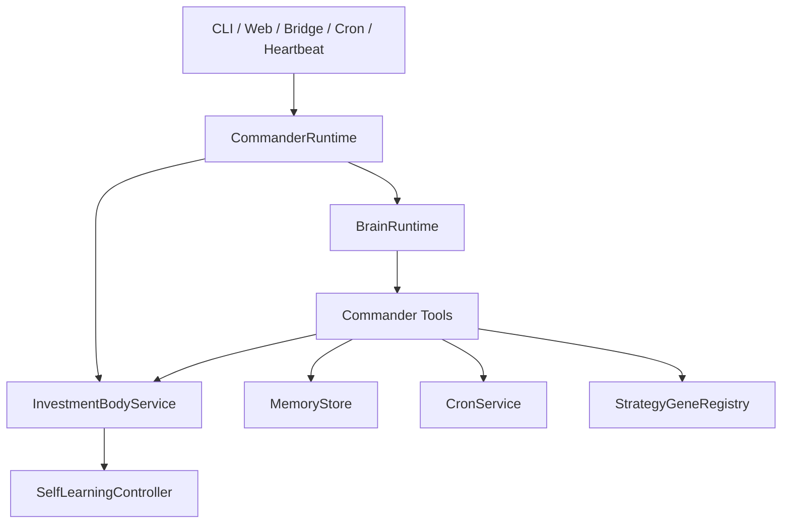

# 主链路说明（以当前实现为准）

> 定位：这是一个以 Agent 为第一用户、以治理与可控性为核心约束的投资训练 / 研究 / 运行底座。  
> 人类主要通过 CLI、Web 与控制面观察、授权、纠偏，而不是手工串起每一层执行逻辑。

本文描述当前仓库真正生效的主链路，基于以下实现：

- `app/commander.py`
- `app/train.py`
- `app/web_server.py`
- `market_data/`
- `invest/`
- `brain/`

## 0. 系统性质

从当前实现看，这条主链路更接近“受控协作运行时”，而不只是“一个能跑训练的投资脚本”：

- `CommanderRuntime` 与 `BrainRuntime` 负责统一调度、工具调用、事件流与操作面。
- `InvestmentBodyService` 与 `SelfLearningController` 负责训练执行与结果聚合。
- `market_data/` 是事实数据底座，训练与运行都围绕同一 canonical SQLite 展开。
- `runtime/`、Training Lab、meeting logs、outputs 共同构成审计与复盘平面。
- `invest/shared/model_governance.py` 把 routing、promotion、deployment stage、quality gate 收到统一治理语义里。

## 1. 三个正式入口

### 1.1 Commander 入口

`app/commander.py` 负责装配统一运行时：

- 构建 `CommanderConfig`
- 注入 runtime path override
- 启动 `CommanderRuntime`
- 挂接 `BrainRuntime`、`InvestmentBodyService`、`CronService`、`HeartbeatService`
- 提供 CLI 子命令：`run`、`status`、`train-once`、`ask`、`strategies`

### 1.2 训练入口

`app/train.py` 直接暴露 `SelfLearningController` 的研究/批量训练能力，适合：

- 纯训练
- mock 验证
- 单独跑 freeze / optimization / allocator 相关逻辑

### 1.3 Web 入口

`app/web_server.py` 提供：

- 静态控制台页面
- 状态 / 训练 / 策略 / 配置 / 数据 API
- SSE 实时事件流
- Training Lab 计划 / 运行 / 评估接口

Web 模式会显式关闭：

- autopilot
- heartbeat
- bridge

以保证前端交互是**手动触发、可观察、低副作用**的。

## 2. Commander 主链路

### 2.1 `CommanderRuntime` 做什么

- 持有全局 runtime 状态
- 管理单实例锁 `runtime/state/commander.lock`
- 管理训练互斥锁 `runtime/state/training.lock`
- 向 Brain 暴露投资相关工具
- 生成并持久化 training plan / run / evaluation 工件
- 将训练摘要追加到 memory
- 暴露统一 `status()` 快照给 CLI / Web / tool calling

### 2.2 `BrainRuntime` 做什么

- 管理 session
- 调用统一 LLM 出口 `app/llm_gateway.py`
- 执行 tool calling
- 负责 Commander 对话、任务编排与自然语言交互

### 2.3 `InvestmentBodyService` 做什么

- 维护训练运行态统计
- 串行执行训练轮次，避免并发训练
- 将 `SelfLearningController.run_training_cycle()` 的结果转换为统一结果字典
- 维护 `total_cycles / success_cycles / no_data_cycles / failed_cycles`
- 发射训练开始/结束事件

## 3. 训练主链路

训练核心只认 `SelfLearningController.run_training_cycle()` 这一条链路。

```mermaid
flowchart LR
    A[随机截断日] --> B[DataManager 训练准备检查]
    B --> C[加载股票历史数据]
    C --> D[InvestmentModel.process]
    D --> E[SelectionMeeting]
    E --> F[TradingPlan]
    F --> G[SimulatedTrader]
    G --> H[StrategyEvaluator / BenchmarkEvaluator]
    H --> I[ReviewMeeting]
    I --> J[Loss Optimization / YAML Mutation]
    J --> K[保存周期结果与快照]
```

详细步骤见 `docs/TRAINING_FLOW.md`。

## 4. 数据读取主链路

### 4.1 写路径

- `market_data/ingestion.py` 负责从 `baostock` / `tushare` / `akshare` 同步数据
- 所有同步都写入 `MarketDataRepository` 管理的 canonical SQLite
- 默认数据库路径为 `data/stock_history.db`

### 4.2 读路径

- 训练读取：`TrainingDatasetBuilder`
- Web 状态读取：`WebDatasetService`
- T0 / 盘中读取：`T0DatasetBuilder`、`IntradayDatasetBuilder`
- 兼容 façade：`DataManager`

## 5. Training Lab 主链路

`CommanderRuntime` 在每次直接训练或计划执行时，都会维护三类工件：

- `runtime/state/training_plans/*.json`
- `runtime/state/training_runs/*.json`
- `runtime/state/training_evals/*.json`

其职责分工为：

- **plan**：描述实验目标、轮次、数据/模型/优化协议
- **run**：记录一次实际执行的原始输出
- **evaluation**：记录汇总指标、promotion 判断与对 baseline 的比较

## 6. Web API 主链路

当前 Web API 可以按职责分成 7 组：

1. **状态与事件**
   - `/api/status`
   - `/api/lab/status/quick`
   - `/api/lab/status/deep`
   - `/api/events`
2. **对话与训练**
   - `/api/chat`
   - `/api/train`
3. **Training Lab**
   - `/api/lab/training/plans`
   - `/api/lab/training/runs`
   - `/api/lab/training/evaluations`
4. **模型与策略**
   - `/api/investment-models`
   - `/api/leaderboard`
   - `/api/allocator`
   - `/api/strategies`
5. **调度与记忆**
   - `/api/cron`
   - `/api/memory`
6. **配置治理**
   - `/api/agent_prompts`
   - `/api/runtime_paths`
   - `/api/evolution_config`（训练参数） / `/api/control_plane`（LLM）
7. **数据管理**
   - `/api/data/status`
   - `/api/data/capital_flow`
   - `/api/data/dragon_tiger`
   - `/api/data/intraday_60m`
   - `/api/data/download`

## 7. 结果状态语义

### 7.1 单周期结果

`InvestmentBodyService.run_cycles()` 中单轮结果有三种状态：

- `ok`：周期成功完成
- `no_data`：因为数据不足、无可交易标的或未来交易日不足而跳过
- `error`：周期执行异常

### 7.2 多轮运行结果

多轮运行的顶层 `status` 由结果聚合得出：

- `completed`
- `completed_with_skips`
- `insufficient_data`
- `partial_failure`
- `failed`
- `busy`

## 8. 当前主链的边界约束

- 所有外部 LLM 调用都必须走 `app/llm_gateway.py`
- Web 只是薄壳，不重复实现训练/配置逻辑
- 训练计划与训练运行必须可审计、可重放、可追溯
- 当前运行时默认单实例
- 当前默认数据主路径是单库 `data/stock_history.db`

## 9. 阅读建议

如果你正在理解当前代码，推荐顺序：

1. `app/commander.py`
2. `app/train.py`
3. `market_data/manager.py`
4. `market_data/datasets.py`
5. `invest/meetings/selection.py`
6. `invest/meetings/review.py`
7. `app/web_server.py`
