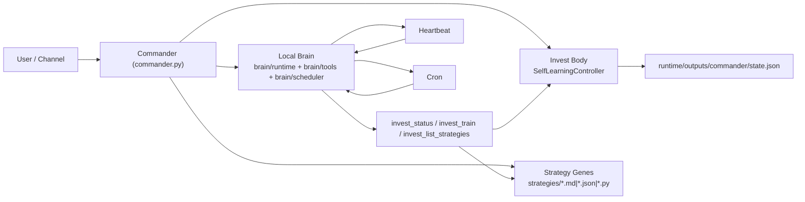

# Nanobot × Invest 融合架构与代码方案

## 目标
把 `nanobot` 与投资进化系统从“两个独立程序”改为“一个统一主程序”。

融合后定义：
- 大脑（Brain）: `brain/` 包内的本地 runtime（保留 nanobot 思路）
- 身体（Body）: `app/` + `invest/` 包内的投资训练与交易执行引擎
- 基因（Genes）: 可插拔策略资产（`md/json/py`）
- 指挥官入口（Commander）: `python commander.py`

## 落地结果（本次已实现）
1. 新增统一入口 `commander.py`
- 单进程编排本地 brain runtime + 投资引擎
- 支持 `run/status/train-once/ask/strategies` 子命令

2. 统一进程内调用
- `invest_train`、`invest_quick_test` 等核心投资工具改为同进程调用
- 去掉 subprocess 桥接路径依赖
- 训练循环直接复用 `SelfLearningController`

3. 策略基因可插拔
- 新增 `StrategyGeneRegistry`
- 支持扫描 `strategies/*.md|*.json|*.py`
- 支持热重载：`invest_reload_strategies`
- 自动生成模板策略：`momentum_trend.md` / `mean_reversion.json` / `risk_guard.py`

4. 24小时常驻调度骨架（本地实现）
- autopilot 周期训练循环
- heartbeat 周期唤醒任务
- cron 作业执行回调（调用融合后指挥官）

5. 运行时代码统一在明确分层的包目录
- 新增 `brain/runtime.py`（本地 AgentLoop/Tool 调用核心）
- 新增 `brain/scheduler.py`（本地 cron + heartbeat）
- 新增 `brain/tools.py`（投资工具集）

## 运行架构



## 关键代码边界（按包分层）
- 主入口: `commander.py`
- Brain核心: `brain/runtime.py`
- 调度核心: `brain/scheduler.py`
- 工具核心: `brain/tools.py`
- 训练/评估主体: `app/train.py`, `invest/evaluation/`, `invest/trading/`, `invest/selection/`, `invest/evolution/`

> 说明：根目录 `nanobot-main_副本/` 现作为参考代码保留，不再是 Commander 运行时必需依赖。

## 指挥官命令
```bash
# 状态
python commander.py status

# 策略基因
python commander.py strategies --reload

# 单轮训练（mock）
python commander.py train-once --rounds 1 --mock

# 常驻运行
python commander.py run
```

## 设计取舍
- 保留 nanobot 设计理念，但真实运行时代码已收口到 `app/` 与 `brain/` 包，根目录仅保留兼容入口。
- 将投资工具内聚到同进程，避免“系统作为插件被调用”的反向关系。
- 策略层保留文件形态，保障可编辑、可替换、可审计。

## 后续建议
1. 把实时行情接入与交易日历接入 `Commander` 的调度条件（仅交易时段触发实盘流程）。
2. 增加 `paper/live` 双通道门控，把训练与实盘执行彻底隔离。
3. 为 `strategies/*.py` 增加沙箱执行与签名校验，降低可执行基因风险。
