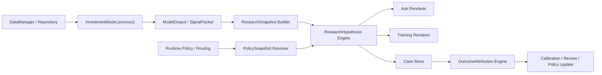
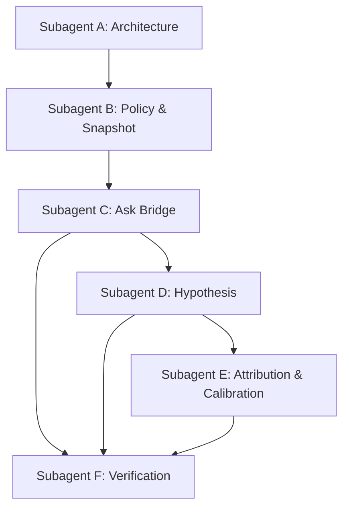

# 研究一体化融合执行蓝图（2026-03-12）

## 1. 文档定位

本文档是 `/docs/RESEARCH_ENGINE_UNIFICATION_PROPOSAL_20260312.md` 的执行版蓝图。

它回答五个问题：

1. 先做什么，后做什么
2. 每一阶段要交付什么
3. 什么叫“做完了”
4. 由哪些 subagent / 工作单元来推进
5. 每个阶段该启用哪些 skills 与验证机制

本文档目标不是继续讨论理念，而是直接指导项目启动与推进。

---

## 2. 总目标与边界

### 2.1 总目标

把当前系统从：

- 训练链闭环 + 问股链解释器

升级为：

- **统一研究引擎（Unified Research Engine）**
- **训练 = 批量学习视角**
- **问股 = 单样本投影视角**
- **二者共享同一语义、同一因果、同一验证闭环**

### 2.2 本次升级必须达成的结果

本次升级完成后，应具备以下能力：

1. `ask_stock` 默认读取当前真实 active/routed model 的研究内核结果
2. 问股和训练共享同一份 canonical research contract
3. 问股输出可以被事后评分，而不是只留下解释文案
4. 问股样本可以进入训练校准集
5. 概率/区间输出有可持续校准机制

### 2.3 明确不在本轮范围内的事项

以下内容不作为启动阻塞项：

- 实盘券商接入
- 全量订单域重构
- 全量分钟级 / tick 级统一
- 复杂黑盒概率模型
- 全前端重构

这些能力可以作为后续 Phase 4+ 追加，不进入当前启动门槛。

---

## 3. 设计原则

### 3.1 三条硬约束

1. **严格时序因果**
   - 任何研究结论必须绑定 `as_of_date`
   - 只能消费当时可见数据
   - 问股必须支持回放模式

2. **统一研究语义**
   - 因子定义统一
   - policy 统一
   - 归因语言统一
   - horizon 评分协议统一

3. **最小破坏式演进**
   - 优先 bridge，不优先 rewrite
   - 优先让 ask_stock 接训练内核，不优先重写训练器
   - 优先新增研究域模块，不继续把逻辑堆入 `app/train.py`

### 3.2 工程优先级原则

按优先级排序：

1. 先统一 contract
2. 再统一 ask entrypoint
3. 再建立可评分 case store
4. 最后才引入概率引擎与更深归因

### 3.3 双轨期原则

双轨并行必须短、可比较、可拔掉：

- 旧 `dashboard` 允许保留
- 旧 YAML 评分允许短期保留为 fallback
- 但每一阶段都必须定义“旧轨退出条件”

---

## 4. 目标架构蓝图

### 4.1 统一研究域模块

建议新增：

```text
invest/research/
├─ __init__.py
├─ contracts.py
├─ snapshot_builder.py
├─ policy_resolver.py
├─ hypothesis_engine.py
├─ scenario_engine.py
├─ attribution_engine.py
├─ case_store.py
├─ renderers.py
└─ selectors.py
```

### 4.2 四大核心对象

#### A. `ResearchSnapshot`

作用：统一“时点研究样本”。

最小字段：

- `snapshot_id`
- `as_of_date`
- `scope` (`single_security` / `universe_batch`)
- `security` / `universe`
- `market_context`
- `cross_section_context`
- `feature_snapshot`
- `data_lineage`
- `feature_version`
- `readiness`

#### B. `PolicySnapshot`

作用：统一“策略状态快照”。

最小字段：

- `policy_id`
- `model_name`
- `config_name`
- `params`
- `risk_policy`
- `execution_policy`
- `evaluation_policy`
- `review_policy`
- `agent_weights`
- `routing_context`
- `feature_version`
- `data_window`
- `version_hash`

#### C. `ResearchHypothesis`

作用：统一“研究结论对象”。

最小字段：

- `hypothesis_id`
- `snapshot_id`
- `policy_id`
- `stance`
- `score`
- `rank`
- `percentile`
- `selected_by_policy`
- `entry_rule`
- `invalidation_rule`
- `de_risk_rule`
- `supporting_factors`
- `contradicting_factors`
- `scenario_distribution`
- `expected_return_interval`
- `confidence`
- `evaluation_protocol`

#### D. `OutcomeAttribution`

作用：统一“事后评分与回灌对象”。

最小字段：

- `attribution_id`
- `hypothesis_id`
- `horizon_results`
- `thesis_result`
- `factor_attribution`
- `timing_attribution`
- `risk_attribution`
- `execution_attribution`
- `calibration_metrics`
- `policy_update_candidates`

### 4.3 最关键补强：PolicySnapshot 可复现签名

`version_hash` 不允许只哈配置文本，必须哈以下元素：

- `model_name`
- `config_name`
- `params`
- `risk_policy`
- `execution_policy`
- `evaluation_policy`
- `review_policy`
- `agent_weights`
- `routing_context.selected_model`
- `routing_context.regime`
- `data_window.lookback_days`
- `data_window.universe_definition`
- `feature_version`
- `code_contract_version`

建议 signature 原文结构：

```json
{
  "model_name": "momentum",
  "config_name": "momentum_v1",
  "params": {...},
  "risk_policy": {...},
  "execution_policy": {...},
  "evaluation_policy": {...},
  "review_policy": {...},
  "agent_weights": {...},
  "routing_context": {
    "selected_model": "momentum",
    "regime": "bull",
    "decision_source": "router"
  },
  "data_window": {
    "lookback_days": 240,
    "simulation_days": 30,
    "universe_definition": "max_stocks=300|min_history_days=200"
  },
  "feature_version": "research.features.v1",
  "code_contract_version": "research.contracts.v1"
}
```

然后对 canonical JSON 做 stable hash。

### 4.4 最关键补强：OutcomeAttribution 评分时钟

`OutcomeAttribution` 必须原生支持 multi-horizon，而不是只给单一 `hit/miss`。

建议协议：

- `T+5`
- `T+10`
- `T+20`
- `T+60`

每个 horizon 独立输出：

- `return_pct`
- `excess_return_pct`
- `max_favorable_excursion`
- `max_adverse_excursion`
- `entry_triggered`
- `invalidation_triggered`
- `de_risk_triggered`
- `label`

`label` 统一为：

- `hit`
- `miss`
- `invalidated`
- `timeout`
- `not_triggered`

最终 thesis 不再是单点结论，而是：

- `short_horizon_result`
- `mid_horizon_result`
- `long_horizon_result`
- `aggregate_result`

---

## 5. 主链路重构策略

### 5.1 总体策略

不是重写训练链，而是在训练链与问股链之间插入统一研究层：



### 5.2 ask_stock 升级策略

`ask_stock` 从：

- 先做 YAML 工具计划
- 再局部打分

升级为：

1. 解析 `query` + `as_of_date`
2. 解析当前 active/routed model
3. 基于同一数据入口构造 `ModelOutput`
4. 构造 queried symbol 的 `ResearchSnapshot`
5. 解析当前 `PolicySnapshot`
6. 生成 `ResearchHypothesis`
7. 用 YAML DSL 决定补充证据与展示风格
8. 落研究 case
9. 返回 ask 视图

### 5.3 YAML 的新定位

YAML 不再决定“是否值得买”，只负责：

- 选择研究 lens
- 选择证据探针
- 生成解释视图
- 约束工具边界

也即：

- 决策内核 = `PolicySnapshot + ResearchHypothesis`
- YAML = `Evidence View DSL`

---

## 6. 实施路径图

### 6.1 Phase 0：统一契约与桥接设计

#### 目标

先把术语冻结成可编码 contract，并给问股接训练内核铺桥。

#### 交付物

1. `invest/research/contracts.py`
2. `invest/research/policy_resolver.py`
3. `invest/research/snapshot_builder.py`（最小版）
4. `docs/research/phase0_contract_mapping.md`
5. `.Codex/evals/research-unification-phase0.md`

#### 主要任务

- 建 Research domain contracts
- 明确旧对象到新对象映射
- 定义 `version_hash` canonical schema
- 定义 `horizon_results` schema
- 确定 case storage layout
- 确定 `ask_stock(as_of_date=...)` API 语义

#### 入口条件

- 当前 proposal 已确认
- 目录结构允许新增 `invest/research/`

#### 验收标准

- 研究 contract 可被导入、序列化、落盘
- `PolicySnapshot.version_hash` 对相同输入稳定一致
- `OutcomeAttribution.horizon_results` schema 固化
- `ask_stock` 的目标 API 和回放语义成文
- 至少 1 份 capability eval + 1 份 regression eval 已定义

#### 退出门

- 任何旧对象到新对象的映射仍然模糊 → 不允许进 Phase 1

---

### 6.2 Phase 1：ask_stock 接入真实策略内核

#### 目标

让 ask_stock 默认读取 active/routed model 的真实 `ModelOutput`，完成第一层统一。

#### 交付物

1. `ask_stock` 新入口参数：`as_of_date`
2. `research.snapshot_builder` 最小可运行
3. `research.policy_resolver` 最小可运行
4. queried symbol 的 rank / percentile / threshold gap / selected_by_policy 输出
5. 兼容旧 dashboard 的 bridge renderer

#### 主要任务

- 复用 `InvestmentModel.process()` 结果
- 若用户问单标，也构造同一时点 universe 研究上下文
- 提取 queried symbol 在 `SignalPacket.signals` 或 universe summaries 中的位置
- 输出 canonical `ResearchSnapshot` + `PolicySnapshot`
- 保留 YAML tools 作为补证层

#### 验收标准

- 问股结论与当前 routed model 口径一致
- 问股可返回 queried symbol 的：
  - `selected_by_policy`
  - `rank`
  - `percentile`
  - `threshold_gap`
  - `policy_id`
- 旧 `dashboard` 仍可被渲染
- 至少 6 个新增测试通过：
  - 回放模式不偷看未来
  - active model 与 ask 输出一致
  - queried symbol 入选/未入选都可解释
  - routing 切换后问股跟随变化
  - version_hash 稳定
  - fallback 语义明确

#### 退出门

- ask_stock 仍依赖 YAML 评分给出核心 stance → 不允许进 Phase 2

---

### 6.3 Phase 2：ResearchHypothesis 上线并替代旧 dashboard 作为主语义

#### 目标

把问股输出从“解释性面板”升级为“结构化研究结论”。

#### 交付物

1. `research/hypothesis_engine.py`
2. `ResearchHypothesis` ask renderer
3. `dashboard` 降级为 projection
4. `strategy DSL` 明确降级为 `Evidence View DSL`

#### 主要任务

- 生成 `stance`
- 生成 `entry_rule / invalidation_rule / de_risk_rule`
- 输出 `supporting_factors / contradicting_factors`
- 输出 `evaluation_protocol`
- 让旧 UI 透过 renderer 消费新对象

#### 验收标准

- ask API 主输出包含 `ResearchHypothesis`
- YAML 不再单独决定 stance
- 问股输出可直接被保存为 case，不依赖额外补字段
- 至少 80% 的旧问股用例在桥接层保持兼容

#### 退出门

- 仍然存在两套“最终结论对象”并行对外暴露 → 不允许进 Phase 3

---

### 6.4 Phase 3：Case Store 与 OutcomeAttribution

#### 目标

把问股样本变成真正可事后评分、可回灌训练的研究 case。

#### 交付物

1. `research/case_store.py`
2. `research/attribution_engine.py`
3. `runtime/state/research_cases/`
4. `runtime/state/research_attributions/`
5. 校准报告生成器

#### 主要任务

- 每次 ask_stock 产生 `research_case_id`
- 持久化 snapshot / policy / hypothesis
- 到达 horizon 或触发失效时生成 attribution
- 形成 calibration report
- 给训练侧提供可消费的校准输入

#### 验收标准

- case 可按 `policy_id`、`symbol`、`as_of_date`、`horizon` 检索
- `T+5/T+10/T+20/T+60` 至少一个 demo case 全链路可跑通
- 校准输出包含：
  - Brier-like direction score
  - interval hit rate
  - invalidation timeliness
  - scenario hit distribution
- 训练侧可以消费 attribution summary

#### 退出门

- 问股样本无法自动进入训练校准环 → 不允许宣布闭环完成

---

### 6.5 Phase 4：相似样本分布与情景推演

#### 目标

上线第一版可解释概率推演能力。

#### 交付物

1. `research/scenario_engine.py`
2. 相似样本检索器
3. 多 horizon 收益分布输出
4. Bull / Base / Bear 三情景输出

#### 验收标准

- ask 输出概率与区间
- 概率输出有校准监控
- 新输出不破坏 Phase 1-3 的结构化契约

---

## 7. 工作流拆分与 subagent 调度方案

### 7.1 调度原则

遵循 `agentic-engineering` 的 15 分钟工作单元原则：

- 每个单元只有一个主风险
- 每个单元有明确产物
- 每个单元可独立验收

### 7.2 subagent 角色定义

#### Subagent A：Architecture Agent

- **目标**：冻结 research domain 边界和 contract
- **输入**：proposal、现有 contracts、train/ask 主链
- **输出**：contract schema、模块边界、迁移映射表
- **完成标准**：Phase 0 contract 与 mapping 文档落盘
- **主风险**：抽象脱离现有代码
- **建议 skills**：`agentic-engineering`、`pi-planning-with-files`

#### Subagent B：Policy & Snapshot Agent

- **目标**：实现 `PolicySnapshot` 与 `ResearchSnapshot` 最小桥接层
- **输入**：`app/train.py`、`invest/models/*`、`invest/contracts/*`
- **输出**：`policy_resolver.py`、`snapshot_builder.py`
- **完成标准**：可从 active/routed model 构造 snapshot + stable hash
- **主风险**：policy 漂移、路由上下文漏字段
- **建议 skills**：`python-patterns`、`agentic-engineering`

#### Subagent C：Ask Bridge Agent

- **目标**：把 `ask_stock` 接入真实内核
- **输入**：`app/stock_analysis.py`、snapshot/policy builder
- **输出**：ask bridge、兼容旧 dashboard 的 renderer
- **完成标准**：问股能返回 rank / percentile / threshold gap / selected_by_policy
- **主风险**：旧问股结果兼容性下降
- **建议 skills**：`python-patterns`、`python-testing`

#### Subagent D：Hypothesis Agent

- **目标**：把问股主输出升级为 `ResearchHypothesis`
- **输入**：snapshot + policy + legacy dashboard semantics
- **输出**：`hypothesis_engine.py`、ask renderer v2
- **完成标准**：核心 stance 不再由 YAML scoring 决定
- **主风险**：双轨结论并存过久
- **建议 skills**：`python-patterns`、`eval-harness`

#### Subagent E：Attribution & Calibration Agent

- **目标**：实现 case store、多 horizon 评分与校准报告
- **输入**：research cases、training eval inputs
- **输出**：`case_store.py`、`attribution_engine.py`、校准报告
- **完成标准**：至少一个 demo case 跑完整个评分时钟
- **主风险**：评分协议定义不一致
- **建议 skills**：`eval-harness`、`python-testing`

#### Subagent F：Verification Agent

- **目标**：维护 capability / regression / compatibility 验收门
- **输入**：阶段交付物、测试结果、diff
- **输出**：阶段验证报告
- **完成标准**：每阶段 exit gate clear
- **主风险**：阶段完成但不可上线
- **建议 skills**：`verification-loop`、`eval-harness`

### 7.3 推荐调度顺序



### 7.4 建议并行策略

可并行：

- A 与现状摸底/测试基线整理
- B 与 F 的 eval 定义
- D 与 E 的 schema 设计

不可并行：

- B 未冻结前，不要开始大规模 ask bridge 改造
- Hypothesis 未冻结前，不要让前端或外部 API 绑定最终字段
- scoring 时钟未冻结前，不要把 attribution 回灌训练

---

## 8. Skills 使用方案

### 8.1 总体技能编排顺序

1. `pi-planning-with-files`
2. `agentic-engineering`
3. `eval-harness`
4. `python-patterns`
5. `python-testing`
6. `verification-loop`
7. `search-first`（仅在实现被现有能力阻塞时启用）

### 8.2 各阶段技能矩阵

| 阶段 | 主 skills | 使用目的 |
|---|---|---|
| Phase 0 | `pi-planning-with-files`, `agentic-engineering`, `eval-harness` | 冻结 contract、定义完成标准与 eval |
| Phase 1 | `python-patterns`, `python-testing`, `eval-harness` | ask bridge 与 snapshot/policy bridge 实现 |
| Phase 2 | `python-patterns`, `python-testing`, `eval-harness` | hypothesis engine 与 renderer 升级 |
| Phase 3 | `python-testing`, `eval-harness`, `verification-loop` | case store、多 horizon attribution、校准报告 |
| Phase 4 | `search-first`, `python-patterns`, `python-testing` | 相似样本分布引擎与情景化输出 |

### 8.3 Skills 使用规则

#### `pi-planning-with-files`

使用时机：

- 整体项目推进
- 跨多个 session 的长周期实施
- 任何超过 5 个工具调用的大阶段

必须产出：

- `task_plan.md`
- `findings.md`
- `progress.md`

#### `agentic-engineering`

使用时机：

- 每个阶段开始前
- 任何跨模块重构前

必须产出：

- capability eval 清单
- regression eval 清单
- 15 分钟工作单元拆解

#### `eval-harness`

使用时机：

- 每个 phase 开始前定义 eval
- 每个 phase 完成后复跑 eval

必须产出：

- `.Codex/evals/research-unification-phaseX.md`
- phase eval report

#### `python-patterns`

使用时机：

- 新增 `invest/research/` 模块
- 任何 contracts / builder / engine 编码

必须遵守：

- dataclass 清晰建模
- 显式类型提示
- 明确异常边界
- 避免隐式魔法状态

#### `python-testing`

使用时机：

- contracts
- ask bridge
- attribution
- scenario engine

必须覆盖：

- 正常路径
- 回放时序边界
- 配置漂移场景
- routing 切换场景
- horizon 评分协议

#### `verification-loop`

使用时机：

- 每个大阶段完成后
- 准备合并/交付前

必须报告：

- build
- type/lint
- targeted tests
- security/diff review

#### `search-first`

使用时机：

- 需要引入 hash/stable serialization/schema validation/case storage helper 时
- 如果 repo 内已有能力不清晰

原则：

- 先搜 repo
- 再查 skill/MCP
- 最后才引第三方依赖

---

## 9. 验收标准体系

### 9.1 顶层 capability eval

#### Capability Eval A：问股读取真实策略内核

成功标准：

- ask_stock 可接受 `as_of_date`
- ask_stock 能读取当前 active/routed model output
- ask_stock 能返回 queried symbol 的横截面位置

#### Capability Eval B：统一研究 contract 可落盘可回放

成功标准：

- `ResearchSnapshot` / `PolicySnapshot` / `ResearchHypothesis` / `OutcomeAttribution` 可序列化
- 同一输入下 `version_hash` 稳定一致
- case 可从 runtime 工件回放

#### Capability Eval C：问股结论可评分

成功标准：

- ask case 自动生成 `research_case_id`
- 至少一个 demo case 能产生 multi-horizon attribution
- calibration report 可输出

### 9.2 regression eval

必须保护以下现有能力不退化：

1. 训练主循环仍可运行
2. 原有 `SelectionMeeting` / `ReviewMeeting` 契约不破坏
3. 旧问股 API 不直接崩溃
4. 旧 dashboard 在 bridge 模式下可渲染
5. 现有 `tests/test_stock_analysis_react.py` 主流程保持可适配
6. 现有训练评估链不因 research layer 引入循环依赖

### 9.3 阶段验收门模板

每个阶段都必须回答：

- 输入契约是否冻结？
- 输出契约是否冻结？
- 有无新增 runtime artifact？
- 有无 capability eval 通过？
- 有无 regression eval 失败？
- 旧轨退出条件是否满足？

---

## 10. 测试与验证路线

### 10.1 测试分层

#### 层 1：Contract tests

覆盖：

- schema
- 默认值
- 序列化
- stable hash
- backward-safe renderer

#### 层 2：Bridge tests

覆盖：

- `ask_stock -> active model`
- routing 切换
- queried symbol 入选/未入选
- `as_of_date` 回放边界

#### 层 3：Attribution tests

覆盖：

- multi-horizon scoring
- invalidation 优先级
- not_triggered / timeout 区分
- aggregate_result 规则

#### 层 4：Compatibility tests

覆盖：

- 旧 dashboard projection
- 旧 YAML tool plan 仍可运行
- commander entrypoint 不破

### 10.2 推荐测试文件布局

```text
tests/
├─ test_research_contracts.py
├─ test_research_policy_snapshot.py
├─ test_research_snapshot_builder.py
├─ test_ask_stock_model_bridge.py
├─ test_research_hypothesis_engine.py
├─ test_research_case_store.py
├─ test_research_attribution_engine.py
└─ test_research_backward_compat.py
```

### 10.3 验证节奏

- 小步提交：每完成一个工作单元就跑 targeted tests
- 阶段结束：跑 phase regression pack
- 准备合并：跑 verification loop

---

## 11. 风险清单与防踩坑机制

### 风险 1：概念先行但主链不通

**症状**：contract 很漂亮，但 ask_stock 仍未读真实内核。

**防治**：Phase 1 必须优先，且定义成启动第一里程碑。

### 风险 2：双轨并行期过长

**症状**：旧 dashboard 和新 hypothesis 长期并存，口径冲突。

**防治**：在 Phase 2 明确“新对象是主语义，旧 dashboard 只做 projection”。

### 风险 3：probability 变成更复杂的话术

**症状**：输出概率，但没有 calibration。

**防治**：Phase 3 先落校准协议，再上 Phase 4 概率引擎。

### 风险 4：policy 无法复现

**症状**：事后无法解释当时到底用的是哪套策略状态。

**防治**：`version_hash` 强制纳入 routing、data_window、feature_version。

### 风险 5：future leak 回放失真

**症状**：ask_stock 在历史回放中偷偷用了未来末端数据。

**防治**：`as_of_date` 成为 research domain 一等公民，所有 snapshot builder 强制 filter by cutoff。

---

## 12. 启动 checklist

项目启动前必须确认：

- [ ] proposal 已冻结
- [ ] execution blueprint 已确认
- [ ] Phase 0 capability / regression eval 已定义
- [ ] `invest/research/` 新目录可创建
- [ ] `ask_stock(as_of_date=...)` 接口变更已接受
- [ ] runtime case storage 路径方案已接受
- [ ] 双轨退出策略已接受

---

## 13. 推荐启动顺序（可直接执行）

### Sprint 1

- 完成 Phase 0
- 完成 Phase 1 的最小 bridge
- ask_stock 返回 `policy_id`、`selected_by_policy`、`rank`、`percentile`

### Sprint 2

- 完成 Phase 2
- `ResearchHypothesis` 成为 ask 主语义
- dashboard 退为 projection

### Sprint 3

- 完成 Phase 3
- 打通 case store 和 multi-horizon attribution
- 形成第一个 calibration 报告

### Sprint 4

- 评估是否推进 Phase 4
- 若推进，再做相似样本分布引擎

---

## 14. 最终开工结论

这项升级工作现在已经具备启动条件。

最正确的启动路径不是“大重构训练器”，而是：

1. 先冻结统一研究 contract
2. 再把 ask_stock 接到当前真实策略内核
3. 再把问股输出升级为可评分的 hypothesis
4. 最后把 attribution 与 calibration 接回训练

如果严格按本蓝图推进，就能避免：

- 架构空转
- 双轨长期冲突
- 概率输出失真
- 问股与训练再次分叉

一句话：

> **先桥接，后替换；先可评分，后概率化；先统一研究语义，再扩能力边界。**
