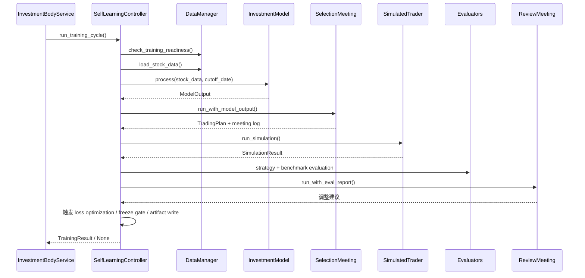

# 训练流程说明（当前实现）

本文只描述当前代码真实执行的训练流程，对应实现为 `app/train.py` 中的 `SelfLearningController`。

## 1. 训练入口

### 1.1 直接训练

- `python3 train.py --cycles 20`（真实数据 / 离线库默认路径）
- `python3 train.py --cycles 5 --mock`（显式 smoke/demo 模式）

### 1.2 通过 Commander 训练

- `python3 commander.py train-once --rounds 1`（真实数据默认路径）
- `python3 commander.py train-once --rounds 1 --mock`（显式 smoke/demo 模式）
- 或创建 plan 后执行 `/api/lab/training/plans/<plan_id>/execute`

这两种入口最终都会汇到：

- `SelfLearningController.run_training_cycle()`
- 或其外层多轮包装 `InvestmentBodyService.run_cycles()`

## 2. 单周期训练步骤

## 3. 详细阶段说明

### 3.1 选择训练截断日

系统会在可用数据范围内随机抽样 `cutoff_date`，同时考虑：

- `experiment_min_date`
- `experiment_max_date`
- `config.min_history_days`
- 后续模拟所需未来交易日数量

### 3.2 训练前数据诊断

先调用 `DataManager.check_training_readiness()`，判断：

- 是否有足够数量的股票满足最小历史长度
- 离线库最新日期是否覆盖训练截断日
- 指数数据是否存在
- 当前 stock target 是否过高

若诊断不通过，不一定立刻报错；系统仍会尝试实际加载数据。真正是否跳过，取决于后续 `load_stock_data()` 是否拿到可用数据。

### 3.3 数据加载

`DataManager.load_stock_data()` 的优先级：

1. canonical 离线库
2. 在线数据加载器（如果可用）
3. mock 数据

若最终仍无数据，本周期返回 `None`，外层会将其记为 `no_data`。

### 3.4 可选 allocator 切换模型

若启用了 allocator：

- 读取 `runtime/outputs/leaderboard.json`
- 基于市场状态 `bull / oscillation / bear` 选择主模型
- 调整 `model_name` 与激活配置

### 3.5 投资模型产出

当前内置模型：

- `momentum`
- `mean_reversion`
- `value_quality`
- `defensive_low_vol`

模型执行 `process()` 后输出 `ModelOutput`，其中至少包含：

- `SignalPacket`
- `AgentContext`
- `model_name`
- `config_name`

### 3.6 选股会议

`SelectionMeeting.run_with_model_output()` 会：

- 读取 `SignalPacket` 与 `AgentContext`
- 组织 Trend / Contrarian / Quality / Defensive 等角色参与判断
- 生成 `TradingPlan`
- 产出 meeting log 与 `StrategyAdvice`

如果会议后没有可交易标的，本周期会被跳过。

### 3.7 模拟交易

`SimulatedTrader` 根据：

- `TradingPlan`
- 选中标的历史数据
- execution policy
- risk policy

执行未来窗口的模拟交易，并返回：

- `final_value`
- `return_pct`
- `trade_history`
- `win_rate`
- `total_trades`

如果截断日之后可用交易日少于 `simulation_days`，本周期跳过。

### 3.8 策略评估与基准评估

评估阶段会写出：

- 策略评分（signal / timing / risk control / overall）
- benchmark 相关指标
- excess return / sharpe / max drawdown 等自评指标

这些指标会进入：

- `TrainingResult.strategy_scores`
- `self_assessment`
- freeze gate 判断
- leaderboard 聚合

### 3.9 复盘会议

`ReviewMeeting.run_with_eval_report()` 在每个成功周期都会运行。

它至少会做三件事：

1. 基于 `EvalReport` 汇总事实
2. 生成 `strategy_suggestions`
3. 输出：
   - `param_adjustments`
   - `agent_weight_adjustments`

如果复盘建议被实际应用，则 `review_applied = true`。

### 3.10 连续亏损优化

若本周期亏损：

- `consecutive_losses += 1`
- 当达到 `max_losses_before_optimize`（默认 3）时，触发 loss optimization

优化动作包括：

- `LLMOptimizer.analyze_loss()` 诊断亏损原因
- 调整当前 runtime params
- `EvolutionEngine.evolve()` 迭代参数种群
- `YamlConfigMutator` 生成候选 YAML 配置
- 记录到 `optimization_events.jsonl`

### 3.11 配置快照与结果落盘

成功周期会生成：

- `runtime/outputs/training/cycle_<id>.json`
- `runtime/logs/meetings/selection/meeting_<id>.json|md`
- `runtime/logs/meetings/review/review_<id>.json|md`
- `runtime/outputs/training/optimization_events.jsonl`
- `runtime/state/config_snapshots/cycle_<id>.json`

## 4. 多轮训练状态

`InvestmentBodyService.run_cycles()` 会把多个周期聚合为统一状态：

- `completed`
- `completed_with_skips`
- `insufficient_data`
- `partial_failure`
- `failed`

## 5. Freeze Gate（固化门控）

由 `app/training/reporting.py` 中的 `should_freeze()` 判定，默认规则为最近窗口同时满足：

- 胜率达到 `freeze_profit_required / freeze_total_cycles`
- 平均收益率 > `avg_return_gt`
- 平均 Sharpe >= `avg_sharpe_gte`
- 平均最大回撤 < `avg_max_drawdown_lt`
- benchmark pass rate >= `benchmark_pass_rate_gte`

默认参数由模型 YAML 的 `train.freeze_gate` 决定。

## 6. Training Lab 工件

通过 Commander 执行训练时，除了单周期结果，还会额外生成：

- `training_plans/*.json`
- `training_runs/*.json`
- `training_evals/*.json`

三者关系如下：

- **Plan**：定义实验要跑什么
- **Run**：记录实验真的怎么跑了
- **Evaluation**：总结跑完后的结果与晋级判断

## 7. 周期跳过的典型原因

当前实现里，最常见的 `no_data` / skip 原因有：

- 没有加载到可用训练数据
- 模型与会议未产出可交易标的
- 选股结果在数据集中不可用
- 截断日期后的未来交易日不足

## 8. 训练输出最值得优先看的文件

推荐排查顺序：

1. `runtime/outputs/training/cycle_*.json`
2. `runtime/logs/meetings/selection/*.md`
3. `runtime/logs/meetings/review/*.md`
4. `runtime/outputs/training/optimization_events.jsonl`
5. `runtime/outputs/leaderboard.json`
