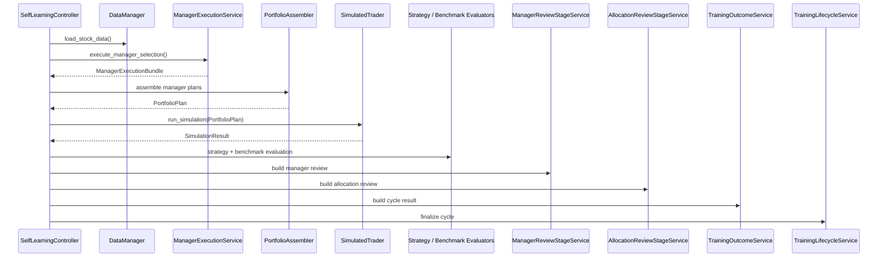

# 训练流程说明（当前实现）

> 当前训练闭环的默认主语是 `manager_results + portfolio_plan`。  
> 本文只描述当前代码实际执行的主链；旧会议对象只保留在归档历史材料中。

## 0. 核心治理对象

当前每个成功周期至少会沉淀这些对象：

- `ManagerRunContext`
- `ManagerPlan`
- `ManagerResult`
- `PortfolioPlan`
- `manager_review_report`（persisted digest）
- `allocation_review_report`（persisted digest）
- `execution_snapshot`
- `review_decision`
- `contract_stage_snapshots`
- `validation_summary`
- `run_context`
- `promotion_record`
- `lineage_record`

围绕训练评估与冻结治理，当前还会在汇总层补充：

- `research_feedback`
- `research_feedback_coverage`
- `return_profile`
- `regime_validation`
- `manager_regime_breakdown`
- `promotion.manager_regime_validation`

## 1. 训练入口

### 1.1 直接训练

- `uv run python -m invest_evolution.interfaces.cli.train --cycles 20`
- `uv run python -m invest_evolution.interfaces.cli.train --cycles 5 --mock`
- `./.venv/bin/python -m invest_evolution.interfaces.cli.train --cycles 20`
- `invest-train --cycles 20`
- `invest-train --cycles 5 --mock`

说明：

- `invest-train` 是正式支持的训练 facade，但当前定位为**批处理 / 兼容入口**。
- 人类日常操作优先使用 `Commander`；直接训练更适合 CI、脚本化实验、release gate 与回归批跑。

### 1.2 通过 Commander 训练

- `uv run python -m invest_evolution.interfaces.cli.commander train-once --rounds 1`
- `./.venv/bin/python -m invest_evolution.interfaces.cli.commander train-once --rounds 1`
- `invest-commander train-once --rounds 1`
- `/api/lab/training/plans/<plan_id>/execute`

说明：

- `Commander` 是当前**唯一推荐的人类训练入口**。
- `/api/lab/training/plans/<plan_id>/execute` 是机器 / Web / automation surface，不替代人类主入口定位。

这两种入口最终都会汇到：

- `SelfLearningController.run_training_cycle()`
- `application/train.py` 作为 facade 入口 owner
- `application/train.py` 负责 CLI 参数进入 facade 与顶层 dispatch
- `application/training/bootstrap.py` 负责 controller 依赖装配、readiness / mock provider / 默认诊断 payload
- `application/training/controller.py` 与 `application/training/execution.py` 负责训练主编排与经理执行主链
- `application/training/review_contracts/__init__.py` 负责阶段 envelopes、TypedDict payload、snapshot builders 与 run-context contract builders

## 2. 单周期训练主链

## 3. 详细阶段

### 3.1 选择训练截断日

训练周期首先确定 `cutoff_date`，考虑：

- `experiment_min_date`
- `experiment_max_date`
- `min_history_days`
- 后续模拟所需交易日

### 3.2 训练前数据准备

`DataManager` 负责：

- 检查训练可用性
- 加载股票历史数据
- 提供 benchmark 和 market index 辅助数据

如果数据不足，本周期直接 `skip`。

### 3.3 多经理运行

`ManagerExecutionService` 基于统一 market snapshot 生成多份 `ManagerPlan`：

- 每个 manager 看到同一时点数据
- 每个 manager 独立出计划
- 每个 manager 产生 attribution / evidence

运行时载体为 `ManagerExecutionBundle`，其中包含：

- `manager_results`
- `portfolio_plan`
- `dominant_manager_id`

### 3.4 组合合成

组合层把多个经理计划收束到单一 `PortfolioPlan`：

- 合并重复持仓
- 汇总 manager weights
- 形成 cash reserve
- 生成最终组合解释

如果未启用完整组合合成，也会退化为 dominant manager only 的组合计划，但主语仍保持在 manager/portfolio 体系内。

### 3.5 模拟执行

`SimulatedTrader` 接收 `PortfolioPlan` 后执行未来窗口模拟：

- `final_value`
- `return_pct`
- `trade_history`
- `win_rate`

### 3.6 策略评估与 benchmark 评估

这一阶段输出：

- `strategy_scores`
- `benchmark_passed`
- `sharpe_ratio`
- `max_drawdown`
- `excess_return`

这些指标会继续进入双层 review 与后续治理。

### 3.7 双层 review

当前 review 正式拆分为两层：

#### `ManagerReviewStageService`

负责判断：

- 哪些经理产出空计划
- 哪些经理与当前 regime 不匹配
- 哪些经理需要继续观察 / 降权

#### `AllocationReviewStageService`

负责判断：

- 组合是否过度集中
- manager budget 是否合理
- cash reserve 是否异常偏高

### 3.8 周期结果构建

`TrainingOutcomeService` 会把本轮结果统一封装为 `TrainingResult`，显式包含：

- `manager_results`
- `portfolio_plan`
- `portfolio_attribution`
- `manager_review_report`
- `allocation_review_report`
- `execution_snapshot`
- `run_context`
- `review_decision`
- `similarity_summary`
- `contract_stage_snapshots`
- `validation_report`
- `validation_summary`
- `dominant_manager_id`
- `execution_defaults`

这里的 `manager_review_report` / `allocation_review_report` 当前语义是“持久化 digest / summary contract”。
完整的 review 构建过程可以在阶段内部展开，但进入周期结果、Training Lab 摘要、Web 读侧与后续 persistence 时，默认应只暴露规范化后的摘要合同。

`model_name` / `config_name` 不再属于当前 canonical result surface；若仍出现在归档样例中，也不代表当前主链事实源。

### 3.9 验证、裁决与生命周期

`run_context` 已经携带 manager-aware / portfolio-aware 信息，供：

- validation
- judge
- promotion
- lineage

继续消费，当前 review / lifecycle / artifacts 默认只围绕 manager / allocation / governance 主语展开。

最后由 `TrainingLifecycleService.finalize_cycle()`：

- 更新 `last_cycle_meta`
- 发射 `cycle_complete`
- 落盘周期工件
- 刷新 leaderboard

## 4. 当前落盘工件

成功周期当前应写出：

- `runtime/outputs/training/cycle_<id>.json`
- `runtime/outputs/training/validation/cycle_<id>_validation.json`
- `runtime/outputs/training/validation/cycle_<id>_peer_comparison.json`
- `runtime/outputs/training/validation/cycle_<id>_judge.json`
- `runtime/state/config_snapshots/cycle_<id>.json`

其中 `cycle_<id>.json` 需要显式体现 manager / portfolio 主语，而不再把单模型字段作为唯一事实源。
同一份周期结果内的 `contract_stage_snapshots` 也应理解为阶段摘要投影，而不是任意 stage 内部中间态的全量转储。

Training Lab / freeze 汇总层当前额外强调以下治理视图：

- `research_feedback_coverage`
  - requested regime 的样本缺口
  - 下一步优先补样的 regime 列表
  - 当前 cycle 对 requested regime 的 evidence 增量
- `assessment.manager_regime_breakdown`
  - 按 `manager x regime` 下钻的收益、基准通过率、策略分与 sample count
- `promotion.manager_regime_validation`
  - 可选启用的二维晋级门，默认关闭，仅在显式开启时参与 verdict

## 5. 历史会议制的当前定位

训练默认链已经完成主语切换。

如果在历史代码或兼容测试里仍然看到会议制模块，它们只应被理解为：

- 历史资产
- 认知辅助层
- 非默认桥接层
