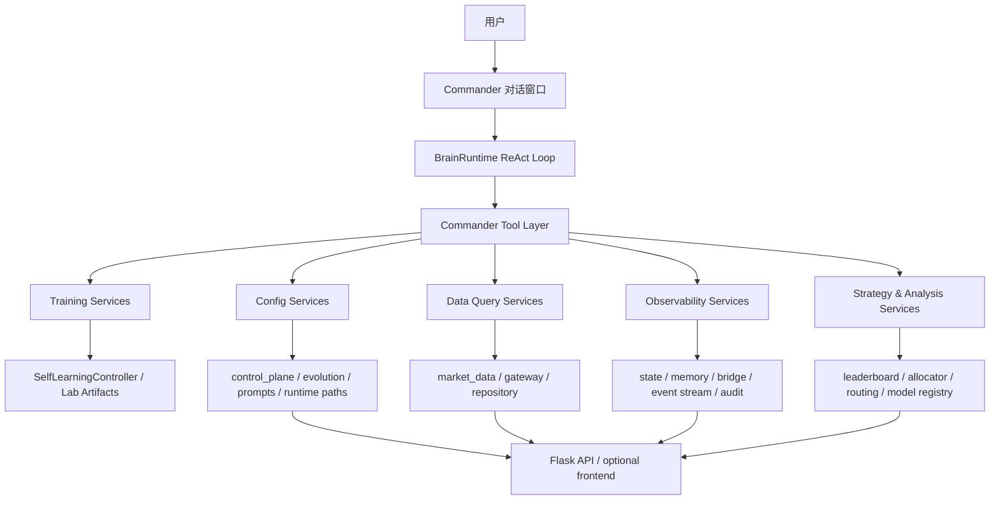
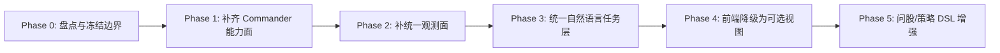

# Commander 统一入口升级总方案（2026-03-11）

## 1. 背景与决策

当前系统已经具备：
- 单仓单进程的训练闭环（`SelfLearningController`）
- 常驻运行时与自然语言 Brain（`CommanderRuntime` + `BrainRuntime`）
- Web API 控制面（状态 / 训练 / Lab / 配置 / 数据 / 可观测）

但三者之间的职责尚未完全统一：
- `Commander` 已覆盖训练执行、计划管理、策略重载、cron、memory 搜索等核心运行面；
- `Web API` 仍独占配置管理、数据查询/下载、leaderboard/allocator/model-routing 查询、事件流等能力；
- 因此，`Commander` 还不是全系统唯一入口，只是“核心运行入口”。

**本轮升级决策：**
1. 将 `Commander` 升级为**唯一人类入口**与**统一控制平面代理**。
2. 保留 `Web API` 作为内部资源层 / 可视化壳 / 外部兼容层，不再作为主入口继续产品化扩张。
3. 前端停止承担关键控制职责，后续只保留“可选监控与回放视图”。

---

## 2. 升级目标

### G1. 入口统一
用户所有日常操作都可通过 `Commander` 对话窗口完成，不再依赖前端页面。

### G2. 能力全覆盖
`Commander` 必须可调度系统全部关键能力：
- 训练与训练实验室
- 策略与模型查询
- 配置管理（control plane / evolution / runtime paths / agent prompts）
- 数据查询与后台下载
- 运行时调度（cron / plugins / memory / diagnostics）
- 全局观测（status / events / degraded / audit）

### G3. 可观测与可解释
`Commander` 不只执行动作，还能解释：
- 当前系统正在做什么
- 最近发生了什么
- 为什么失败 / degraded
- 下一步建议

### G4. 安全与治理
高风险操作必须具备：
- 参数规范化
- 权限与确认策略
- 审计日志
- 可回滚/可追踪

### G5. 前端降级
前端后续仅保留：
- dashboard 可视化
- 训练事件流回放
- 数据图表/只读展示

---

## 3. 非目标

- 本轮不重写训练核心算法。
- 本轮不移除 Flask API 和现有工件目录。
- 本轮不直接构建“投顾问股 Agent”完整产品；先把 `Commander` 变成完整控制平面。
- 本轮不追求把所有 JSON 输出都变成高度拟人对话；优先保证能力完整和审计友好。

---

## 4. 现状差距

### 已有能力（Commander 已具备）
- 自然语言对话 + ReAct 工具调用
- 系统状态快照
- 单轮/多轮训练
- 训练计划创建 / 执行 / 单项结果查询
- 策略 gene 列表 / 重载
- cron 增删查
- memory 搜索
- plugins 重载

### 缺失能力（Commander 尚未覆盖）
- training runs/evaluations 列表
- leaderboard / allocator / model-routing preview / investment-models 查询
- memory 列表与详情
- agent prompts 管理
- runtime paths 管理
- evolution config 管理
- control plane 管理
- data status 独立工具化
- capital flow / dragon tiger / intraday 数据查询
- 数据后台下载/同步任务
- recent events / event summary / diagnostics 汇总
- 合同/契约类资源查询

---

## 5. 目标架构



### 架构原则
1. **能力优先落 Service，不直接堆在 Tool 内。**
2. **Tool 只做参数解析、权限门控、结果包装。**
3. **所有资源域都要有可复用服务接口，可被 Commander 和 Web 共用。**
4. **人类入口统一，底层资源层不必统一到单文件。**

---

## 6. 技术路径图（Implementation Path）



---

## 7. 分阶段实施规划

### Phase 0：基线冻结与资源清单

#### 目标
形成完整的“系统能力 -> Commander 缺口 -> 服务归属”台账，冻结本轮边界。

#### 实施项
1. 盘点所有 `web_server.py` 路由及其底层依赖。
2. 盘点 `CommanderRuntime` 已公开方法与 `brain/tools.py` 工具清单。
3. 建立能力映射表：`API -> Service -> Commander Tool -> 权限级别 -> 验收测试`。
4. 冻结本轮必须接入 Commander 的能力域。

#### 交付物
- 本方案文档
- 功能对照表
- Phase backlog

#### 验收标准
- 所有关键功能域都有归属与缺口判定。
- 实施范围无歧义。

---

### Phase 1：Commander 能力面补齐

#### 目标
让 Commander 在“功能完整性”上覆盖 Web 主控制面。

#### 实施项

##### 1. 训练实验室补全
新增工具/方法：
- `invest_training_runs_list`
- `invest_training_evaluations_list`
- `CommanderRuntime.list_training_runs()`
- `CommanderRuntime.list_training_evaluations()`

##### 2. 分析查询补全
新增工具/方法：
- `invest_investment_models`
- `invest_leaderboard`
- `invest_allocator`
- `invest_model_routing_preview`

##### 3. 配置域补全
新增工具/方法：
- `invest_control_plane_get` / `invest_control_plane_update`
- `invest_runtime_paths_get` / `invest_runtime_paths_update`
- `invest_evolution_config_get` / `invest_evolution_config_update`
- `invest_agent_prompts_list` / `invest_agent_prompts_update`

##### 4. 数据域补全
新增工具/方法：
- `invest_data_status`
- `invest_data_capital_flow`
- `invest_data_dragon_tiger`
- `invest_data_intraday_60m`
- `invest_data_download`

##### 5. 记忆域补全
新增工具/方法：
- `invest_memory_list`
- `invest_memory_get`

#### 技术策略
- 优先把 Web 端已有逻辑抽成 service/helper，避免 Tool 直接复制 web_server 代码。
- 任何写操作都要走统一 service，并保留审计日志。

#### 验收标准
- 不打开前端，用户可通过 Commander 完成 80%+ 的日常操作。
- Web API 的关键资源域均有对应 Tool。
- 新增功能具备 pytest 回归。

---

### Phase 2：Commander 统一观测面

#### 目标
让 Commander 能解释“系统发生了什么”，而不只是吐 JSON。

#### 实施项
1. 新增事件聚合服务：
   - 从 SSE buffer / runtime state / artifacts / memory 汇总最近事件。
2. 新增工具：
   - `invest_events_tail`
   - `invest_events_summary`
   - `invest_runtime_diagnostics`
   - `invest_training_lab_summary`
3. 新增诊断模型：
   - degraded 原因
   - 数据缺失原因
   - 训练失败原因
   - 配置生效状态 / restart required
4. 为高价值结果生成自然语言摘要模板。

#### 验收标准
- 用户能直接问：“现在系统在干什么？”“为什么失败？”“最近 5 次训练怎么样？”
- Commander 返回结构化结论 + 可操作建议。

---

### Phase 3：统一自然语言任务层

#### 目标
把 Tool 调用集合升级成“任务编排入口”，让普通用户不需要知道工具名和 JSON 参数。

#### 实施项
1. 为高频意图建立任务路由模板：
   - 看状态
   - 跑训练
   - 看最近结果
   - 看异常
   - 查模型表现
   - 改配置
   - 查数据健康
2. 对高风险写操作增加确认门控：
   - control plane 更新
   - runtime paths 更新
   - 启动下载任务
   - 多轮真实训练
3. 统一输出风格：
   - `结论 / 证据 / 风险 / 下一步`
4. 为长任务增加进度汇报与结束摘要。

#### 验收标准
- 非技术用户不需要了解 API 和 JSON，也能操作系统。
- 关键管理动作在对话窗口内完成闭环。

---

### Phase 4：前端降级与角色重定义

#### 目标
使前端从“主入口”降级为“可选展示壳”。

#### 实施项
1. 冻结前端新功能开发。
2. 标记前端页面为只读/观测优先。
3. 从文档和运行说明里将 `Commander` 标记为主入口。
4. 清理前端独占能力，确保都已进入 Commander。
5. 保留 Web：
   - `/api/events`
   - `/api/status`
   - dashboard 只读视图
   - 图表与历史回放

#### 验收标准
- 日常运维/训练/配置不依赖前端。
- 前端不可用时，系统仍能完整运行和维护。

---

### Phase 5：问股/策略 DSL 增强（后续）

#### 目标
在统一入口完成后，再引入“自然语言问股 + 工具化分析 + 策略 DSL”。

#### 实施项
1. 建立 stock-analysis tool layer：
   - `get_daily_history`
   - `get_realtime_quote`
   - `analyze_trend`
   - `get_financials`
2. 建立 YAML/JSON 策略 DSL：
   - `required_tools`
   - `analysis_steps`
   - `scoring`
   - `entry/exit/risk`
3. 建立 ask-stock 输出协议：
   - `signal`
   - `score`
   - `entry_price`
   - `stop_loss`
   - `reason`

#### 验收标准
- 用户可以通过 Commander 问：“用 XX 策略分析贵州茅台”。
- Brain 能自动调用数据与分析工具，并输出结构化结论。

---

## 8. 实施技术路径（代码组织）

### 目标代码结构

```text
app/
  commander.py                 # 保留运行时编排，但持续瘦身
  web_server.py                # 保留 Web/BFF/事件出口，逐步降角色

brain/
  runtime.py                   # ReAct Loop
  tools.py                     # 仅保留工具注册与薄封装
  plugins.py                   # JSON/DSL 插件装载

commander/
  services/
    training_lab.py
    analysis_queries.py
    config_admin.py
    data_queries.py
    observability.py
    memory_admin.py
  presenters/
    status_presenter.py
    diagnostics_presenter.py
    training_presenter.py
  policies/
    command_permissions.py
    confirmation_policy.py
```

### 技术原则
- `app/commander.py` 不再继续堆业务细节。
- 新功能优先落 `commander/services/`。
- `brain/tools.py` 中每个 Tool 只做：`参数 -> 调 service -> 返回 JSON/摘要`。
- 如果某能力当前只存在于 `web_server.py`，先抽出共享 service，再让 web 和 commander 共同调用。

---

## 9. Subagent 调度规划（工作单元）

> 这里的 “subagent” 指实施期的并行工作单元，而不是当前仓内运行时 agent。

### Unit A：能力映射与服务抽取
- 范围：`web_server.py` 与 `app/commander.py`
- 目标：抽出 Commander 需要复用的共享 service
- 重点：配置域、数据域、分析查询域

### Unit B：Commander Tool 扩展
- 范围：`brain/tools.py`、`app/commander.py`
- 目标：为缺失能力补全 Tool 与 Runtime facade
- 重点：工具参数契约、错误处理、统一输出

### Unit C：统一观测层
- 范围：events / memory / artifacts / runtime snapshot
- 目标：形成 diagnostics / summary / recent events 能力
- 重点：事件聚合、异常解释、自然语言摘要

### Unit D：权限与确认策略
- 范围：所有写操作 Tool
- 目标：建立风险等级、确认门控、审计日志
- 重点：配置变更、下载任务、训练执行

### Unit E：前端降级与文档迁移
- 范围：README / runbook / web 使用说明
- 目标：把 Commander 定义为主入口，前端定义为可选视图
- 重点：用户操作文档、部署文档、回退策略

### 建议执行顺序
1. Unit A
2. Unit B
3. Unit C
4. Unit D
5. Unit E

---

## 10. Skills 使用规划

### 本轮规划阶段使用的 skills
1. `pi-planning-with-files`
   - 用途：维护 `task_plan.md` / `findings.md` / `progress.md`
2. `agentic-engineering`
   - 用途：按阶段拆分、验收驱动、降低一次性大改风险
3. `backend-patterns`
   - 用途：把 Commander 入口与 Web/BFF/service 的职责边界理顺

### 后续实施建议使用的 skills
1. `backend-patterns`
   - 抽 service、整理 API/运行时边界
2. `coding-standards`
   - 保证 Python/架构实现一致性
3. `tdd-workflow` 或 `python-testing`
   - 为每一波工具与服务补回归
4. `verification-loop`
   - 每阶段收口前跑定向验证与 diff review
5. `search-first`（仅在需要外部模式参考时）
   - 如果要引入对话式控制面设计参考，再做外部调研

---

## 11. 权限模型建议

### 风险等级
- L0：只读查询（状态、数据、leaderboard、memory 查询）
- L1：低风险写操作（重载策略、重载插件）
- L2：中风险写操作（创建训练计划、执行 mock 训练）
- L3：高风险写操作（真实训练、control plane 更新、runtime path 更新、数据下载任务）

### 执行规则
- L0：可直接执行
- L1：默认执行并审计
- L2：需要显式用户意图
- L3：必须二次确认或采用明确命令语义

---

## 12. 验收标准（总体验收）

### 功能覆盖
- Commander 覆盖 Web 主控制面 90%+ 的操作能力。
- Web 前端不再承担关键控制职责。

### 用户体验
- 通过 Commander 对话窗口可完成：
  - 运行状态查询
  - 训练执行
  - 最近结果查看
  - 配置修改
  - 数据健康与数据查询
  - 策略/模型/leaderboard 查询

### 可观测性
- Commander 能回答：
  - 当前系统状态
  - 最近事件
  - 最近失败原因
  - 当前 degraded 原因
  - 是否需要重启

### 工程质量
- 每个新增能力域具备对应测试。
- 共享 service 从 `web_server.py` 中抽离，减少重复逻辑。
- 高风险写操作具备门控和审计。

### 前端角色
- 前端不可用时，核心系统不受阻。
- 文档与 runbook 将 Commander 标识为主入口。

---

## 13. 实施顺序建议（推荐）

### Wave 1（必须先做）
- Phase 1 中的配置域 + 分析查询域 + runs/evaluations 列表
- 目标：补齐 Commander 的管理能力缺口

### Wave 2
- Phase 1 中的数据域 + memory 明细查询
- 目标：补齐数据与只读资源缺口

### Wave 3
- Phase 2 统一观测层
- 目标：让 Commander 具备“解释系统”的能力

### Wave 4
- Phase 3 自然语言任务层 + 权限/确认策略
- 目标：正式把 Commander 升级为唯一人类入口

### Wave 5
- Phase 4 文档迁移 + 前端降级
- 目标：完成入口迁移

### Wave 6（后续增强）
- Phase 5 问股 / 策略 DSL

---

## 14. 回退策略

- 所有新能力先以“增量接入 Commander”方式实现，不先删除 Web API。
- 若某资源域 Commander 接入失败，则保留 Web 作为过渡入口。
- 在 Commander 完成总体验收前，不删除已有 Web 控制能力。

---

## 15. 下一步实施建议

### 立即启动的实施包
1. 抽取共享 service：leaderboard / allocator / model-routing / config admin / data query
2. 扩展 Commander Runtime facade
3. 为缺失资源域补 Commander tools
4. 补定向测试
5. 再进入 observability/diagnostics 层

### 建议本次实施的首批落点
- `CommanderRuntime.list_training_runs()`
- `CommanderRuntime.list_training_evaluations()`
- `CommanderRuntime.get_leaderboard()`
- `CommanderRuntime.get_allocator_preview()`
- `CommanderRuntime.get_model_routing_preview()`
- `CommanderRuntime.get_control_plane()` / `update_control_plane()`
- `CommanderRuntime.get_evolution_config()` / `update_evolution_config()`
- `CommanderRuntime.list_agent_prompts()` / `update_agent_prompts()`

