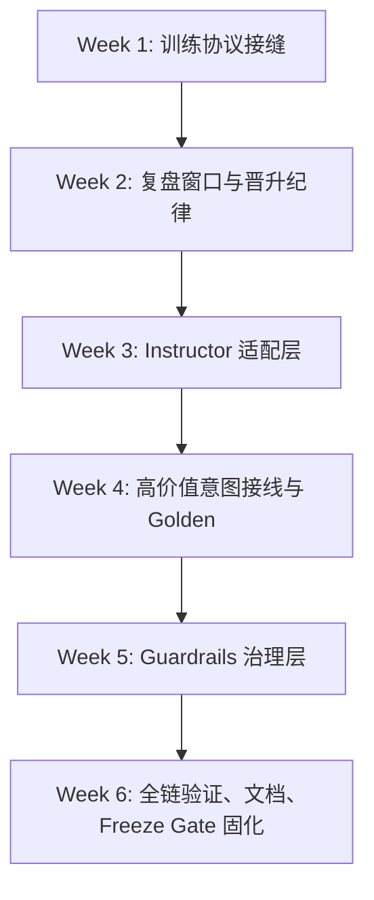

# v1.1 实施蓝图（2026-03-14）

## 1. 版本定位

`v1.1` 的目标不是把系统包装成“更像人类基金经理的自主交易体”，而是把当前系统推进到一个更可信的状态：

- 对内：成为 **可信研究操作系统（trusted research OS）**
- 对外：仍然是 **受控的研究与训练系统**，不是可直接实盘托管资金的全自动引擎

本蓝图承接两份既有计划：

- [Agent Foundation Phased Implementation Plan](/Users/zhangsan/Desktop/投资进化系统v1.0/docs/plans/AGENT_FOUNDATION_PHASED_IMPLEMENTATION_PLAN_20260313.md)
- [Phase 6 Structural Refactor Plan](/Users/zhangsan/Desktop/投资进化系统v1.0/docs/plans/PHASE6_IMPLEMENTATION_PLAN_20260313.md)

核心判断：

1. 现有 `CommanderRuntime -> BrainRuntime -> InvestmentBodyService -> SelfLearningController` 主骨架应保留。
2. `v1.1` 的首要矛盾不是 “Agent 不够多”，而是 “训练协议、输出可靠性、执行治理不够硬”。
3. `Phase 6` 和 `Agent Foundation` 不应并行竞争，而应作为同一条落地路径的前后两段：
   - 先做足够的结构解耦，创造稳定接缝
   - 再在接缝上接入 `Instructor` 和 `Guardrails`

## 2. v1.1 范围与边界

### 2.1 In Scope

- 训练协议硬化与实验边界收紧
- 复盘/优化/候选配置的 lineage 和 promotion 纪律
- `Phase 6` 的最小必要结构下沉
- `Instructor` 的局部结构化输出接入
- `Guardrails` 的高风险写操作治理
- 对应的测试、观测指标和 release gate 更新

### 2.2 Out of Scope

- `PySR` 正式接入主版本
- `E2B` 沙箱后端正式上线
- `Temporal` durable workflow 平台化
- Tick 级 / 分钟级事件驱动回测引擎重写
- 新引入大型 Agent orchestration 框架替换当前 runtime

### 2.3 版本通过标准

`v1.1` 结束时，应至少满足以下标准：

1. 训练实验具备明确的 `experiment spec / run context / promotion record`，而不是隐式状态拼接。
2. `ReviewMeeting` 不再只围绕单周期 `EvalReport` 做解释，而是明确消费滚动窗口事实。
3. 候选 YAML 配置、runtime overrides、active config 三者可区分、可追踪、不可静默混用。
4. 关键 LLM intent 已具备结构化输出适配和失败回退。
5. 高风险 mutating tools 在执行前具备可读的阻断/确认机制。

## 3. 工作流总图

## 4. 模块级实施清单

### 4.1 模块 A：训练协议与实验边界

**优先级：P0，最先动手**

**目标**

- 把当前“随机 cutoff + 运行时状态 + review 建议 + mutation 候选”这种松散闭环，收束成明确的实验协议
- 为后续 `Instructor` / `Guardrails` 建立稳定的训练链路契约

**先改哪些文件**

- [app/train.py](/Users/zhangsan/Desktop/投资进化系统v1.0/app/train.py)
- [app/training/cycle_services.py](/Users/zhangsan/Desktop/投资进化系统v1.0/app/training/cycle_services.py)
- [app/training/execution_services.py](/Users/zhangsan/Desktop/投资进化系统v1.0/app/training/execution_services.py)
- [app/training/review_stage_services.py](/Users/zhangsan/Desktop/投资进化系统v1.0/app/training/review_stage_services.py)
- [app/training/review_services.py](/Users/zhangsan/Desktop/投资进化系统v1.0/app/training/review_services.py)
- [app/training/controller_services.py](/Users/zhangsan/Desktop/投资进化系统v1.0/app/training/controller_services.py)
- [app/training/reporting.py](/Users/zhangsan/Desktop/投资进化系统v1.0/app/training/reporting.py)
- [app/training/optimization.py](/Users/zhangsan/Desktop/投资进化系统v1.0/app/training/optimization.py)
- [invest/meetings/review.py](/Users/zhangsan/Desktop/投资进化系统v1.0/invest/meetings/review.py)
- [invest/evolution/engine.py](/Users/zhangsan/Desktop/投资进化系统v1.0/invest/evolution/engine.py)
- [invest/evolution/mutators.py](/Users/zhangsan/Desktop/投资进化系统v1.0/invest/evolution/mutators.py)
- [docs/TRAINING_FLOW.md](/Users/zhangsan/Desktop/投资进化系统v1.0/docs/TRAINING_FLOW.md)

**建议新增文件**

- `app/training/experiment_protocol.py`
- `app/training/lineage_services.py`
- `app/training/promotion_services.py`
- `app/training/contracts.py`

**要落的行为变更**

1. 把 `ExperimentSpec` 从“临时配置字典”提升为正式协议对象，至少固定：
   - `seed`
   - `date_range`
   - `simulation_days`
   - `allowed_models`
   - `llm_mode`
   - `review_window`
   - `promotion_policy`
2. 在单次训练工件中显式记录：
   - `active_config_ref`
   - `candidate_config_ref`
   - `runtime_overrides`
   - `review_basis_window`
   - `fitness_source_cycles`
   - `promotion_decision`
3. 把“候选 YAML 配置已生成”和“active config 已接管”严格区分。
4. 在未通过 promotion gate 前，不允许 mutation 候选静默替换 active config。
5. 若短期内做不到 GA 个体与结果一一绑定，就明确把当前逻辑降级标注为 heuristic tuner，而不是伪装成严肃 evolutionary search。

**先补哪些测试**

- 扩展 [tests/test_training_controller_services.py](/Users/zhangsan/Desktop/投资进化系统v1.0/tests/test_training_controller_services.py)
- 扩展 [tests/test_training_optimization.py](/Users/zhangsan/Desktop/投资进化系统v1.0/tests/test_training_optimization.py)
- 扩展 [tests/test_research_training_feedback.py](/Users/zhangsan/Desktop/投资进化系统v1.0/tests/test_research_training_feedback.py)
- 扩展 [tests/test_lab_artifacts.py](/Users/zhangsan/Desktop/投资进化系统v1.0/tests/test_lab_artifacts.py)
- 新增 `tests/test_training_experiment_protocol.py`
- 新增 `tests/test_training_review_window.py`
- 新增 `tests/test_training_promotion_lineage.py`

**本模块验收标准**

- `ReviewMeeting` 的输入窗口不是单轮 `EvalReport`，而是明确的 rolling fact set
- 任何 mutation / review 调整都能追溯到来源周期与目标配置
- `training_runs` / `training_evals` 中可以区分 active 与 candidate
- `should_freeze()` 依赖的评估对象有可审计来源

### 4.2 模块 B：Phase 6 最小必要结构解耦

**优先级：P0，与模块 A 并行，但只做必要部分**

**目标**

- 在不大迁移目录的前提下，把 `v1.1` 需要动的链路切出稳定接缝
- 控制 `app/train.py` 和 `brain/runtime.py` 继续膨胀

**先改哪些文件**

- [app/train.py](/Users/zhangsan/Desktop/投资进化系统v1.0/app/train.py)
- [app/commander.py](/Users/zhangsan/Desktop/投资进化系统v1.0/app/commander.py)
- `app/application/` 下新增训练 facade
- `app/interfaces/` 下补 runtime / training registry
- [invest/services/__init__.py](/Users/zhangsan/Desktop/投资进化系统v1.0/invest/services/__init__.py)
- `invest/services/meetings.py`
- `invest/services/evolution.py`
- [tests/test_phase6_wave_a.py](/Users/zhangsan/Desktop/投资进化系统v1.0/tests/test_phase6_wave_a.py)
- [tests/test_architecture_import_rules.py](/Users/zhangsan/Desktop/投资进化系统v1.0/tests/test_architecture_import_rules.py)
- [tests/test_governance_phase_a_f.py](/Users/zhangsan/Desktop/投资进化系统v1.0/tests/test_governance_phase_a_f.py)

**建议新增文件**

- `app/application/training/orchestrator.py`
- `app/application/training/runtime_facade.py`
- `app/interfaces/web/training_routes.py`

**要落的行为变更**

1. 完成 `Wave B` 的主线：把训练编排继续从 `SelfLearningController` 下沉到 orchestrator/service。
2. 只推进 `Wave C` 里与 review / selection / evolution 强相关的 facade，不做大范围 rename。
3. 明确 application layer 负责 orchestration，domain layer 负责 meeting/evolution/data logic。

**先补哪些测试**

- 扩展 [tests/test_phase6_wave_a.py](/Users/zhangsan/Desktop/投资进化系统v1.0/tests/test_phase6_wave_a.py)
- 扩展 [tests/test_architecture_import_rules.py](/Users/zhangsan/Desktop/投资进化系统v1.0/tests/test_architecture_import_rules.py)
- 扩展 [tests/test_governance_phase_a_f.py](/Users/zhangsan/Desktop/投资进化系统v1.0/tests/test_governance_phase_a_f.py)
- 扩展 [tests/test_commander_unified_entry.py](/Users/zhangsan/Desktop/投资进化系统v1.0/tests/test_commander_unified_entry.py)

**本模块验收标准**

- `app/train.py` 继续变薄，训练主链的 orchestration 可在 service 层单测
- 上层入口不需要知道 meeting / evolution 的细节对象
- 结构守卫测试保持通过

### 4.3 模块 C：Instructor 结构化输出层

**优先级：P1，必须建立在模块 A/B 的接缝稳定后**

**目标**

- 给关键 intent 加上 schema-first 的结构化输出、校验、重试和回退
- 降低自由文本响应在下游消费时的脆弱性

**先改哪些文件**

- [app/llm_gateway.py](/Users/zhangsan/Desktop/投资进化系统v1.0/app/llm_gateway.py)
- [brain/runtime.py](/Users/zhangsan/Desktop/投资进化系统v1.0/brain/runtime.py)
- [app/runtime_contract_tools.py](/Users/zhangsan/Desktop/投资进化系统v1.0/app/runtime_contract_tools.py)
- [app/stock_analysis.py](/Users/zhangsan/Desktop/投资进化系统v1.0/app/stock_analysis.py)
- [config/control_plane.py](/Users/zhangsan/Desktop/投资进化系统v1.0/config/control_plane.py)

**建议新增文件**

- `brain/structured_output.py`
- `brain/response_models.py`
- `tests/test_structured_output_adapter.py`

**首批只接这些路径**

- `invest_ask_stock`
- `invest_training_plan_create`
- `invest_training_plan_execute` 的执行总结
- `invest_control_plane_update` 的确认前说明
- `BrainRuntime` 最终 receipt / bounded summary

**先补哪些测试**

- 扩展 [tests/test_brain_runtime.py](/Users/zhangsan/Desktop/投资进化系统v1.0/tests/test_brain_runtime.py)
- 扩展 [tests/test_schema_contracts.py](/Users/zhangsan/Desktop/投资进化系统v1.0/tests/test_schema_contracts.py)
- 扩展 [tests/test_commander_transcript_golden.py](/Users/zhangsan/Desktop/投资进化系统v1.0/tests/test_commander_transcript_golden.py)
- 扩展 [tests/test_commander_direct_planner_golden.py](/Users/zhangsan/Desktop/投资进化系统v1.0/tests/test_commander_direct_planner_golden.py)
- 扩展 [tests/test_stock_analysis_react.py](/Users/zhangsan/Desktop/投资进化系统v1.0/tests/test_stock_analysis_react.py)
- 新增 `tests/test_structured_output_adapter.py`

**本模块验收标准**

- 控制面开关关闭时无回归
- 目标 intent 的结构化输出成功率显著提高
- 失败时能返回明确错误或 fallback，不允许 silently degrade

### 4.4 模块 D：Guardrails 治理层

**优先级：P1，在 Instructor 稳住后接入**

**目标**

- 把当前“参数 schema 校验 + confirm 语义”升级为“业务语义阻断 + 可读风险提示”
- 只保护高风险写路径，不影响只读查询

**先改哪些文件**

- [brain/runtime.py](/Users/zhangsan/Desktop/投资进化系统v1.0/brain/runtime.py)
- [brain/tools.py](/Users/zhangsan/Desktop/投资进化系统v1.0/brain/tools.py)
- [app/commander.py](/Users/zhangsan/Desktop/投资进化系统v1.0/app/commander.py)
- [config/control_plane.py](/Users/zhangsan/Desktop/投资进化系统v1.0/config/control_plane.py)
- `brain/task_bus.py`

**建议新增文件**

- `brain/guardrails.py`
- `brain/guardrails_policies.py`
- `tests/test_guardrails_policies.py`

**首批只守这些工具**

- `invest_control_plane_update`
- `invest_runtime_paths_update`
- `invest_evolution_config_update`
- `invest_training_plan_create`
- `invest_training_plan_execute`
- `invest_data_download`

**先补哪些测试**

- 扩展 [tests/test_commander_mutating_workflow_golden.py](/Users/zhangsan/Desktop/投资进化系统v1.0/tests/test_commander_mutating_workflow_golden.py)
- 扩展 [tests/test_commander_agent_validation.py](/Users/zhangsan/Desktop/投资进化系统v1.0/tests/test_commander_agent_validation.py)
- 扩展 [tests/test_brain_runtime.py](/Users/zhangsan/Desktop/投资进化系统v1.0/tests/test_brain_runtime.py)
- 扩展 [tests/test_training_plan_llm_policy.py](/Users/zhangsan/Desktop/投资进化系统v1.0/tests/test_training_plan_llm_policy.py)
- 新增 `tests/test_guardrails_policies.py`

**本模块验收标准**

- 危险 patch、不完整 plan、缺失 confirm 的高风险执行请求会被阻断
- 阻断原因能通过 protocol payload 明确表达
- 只读链路时延和输出不明显恶化

### 4.5 模块 E：观测、发布门与文档

**优先级：P1，贯穿全程**

**目标**

- 把 `v1.1` 新增的能力纳入 release gate，而不是靠人工记忆

**先改哪些文件**

- [app/freeze_gate.py](/Users/zhangsan/Desktop/投资进化系统v1.0/app/freeze_gate.py)
- [docs/MAIN_FLOW.md](/Users/zhangsan/Desktop/投资进化系统v1.0/docs/MAIN_FLOW.md)
- [docs/TRAINING_FLOW.md](/Users/zhangsan/Desktop/投资进化系统v1.0/docs/TRAINING_FLOW.md)
- 相关 `tests/test_*golden.py`

**建议新增指标**

- structured output success rate
- validation failure rate
- guardrails block rate
- candidate promotion attempt count
- active/candidate drift count

**先补哪些测试**

- 扩展 [tests/test_runtime_api_contract.py](/Users/zhangsan/Desktop/投资进化系统v1.0/tests/test_runtime_api_contract.py)
- 扩展 [tests/test_runtime_contract_generation.py](/Users/zhangsan/Desktop/投资进化系统v1.0/tests/test_runtime_contract_generation.py)
- 扩展 [tests/test_lab_artifacts.py](/Users/zhangsan/Desktop/投资进化系统v1.0/tests/test_lab_artifacts.py)
- 扩展 [tests/test_schema_contracts.py](/Users/zhangsan/Desktop/投资进化系统v1.0/tests/test_schema_contracts.py)

**本模块验收标准**

- `python -m app.freeze_gate --mode quick` 能覆盖 `v1.1` 新能力的关键路径
- 文档与真实实现不再明显脱节

## 5. 测试实施顺序

`v1.1` 不建议“先写代码再补测试”，建议按下面顺序推进：

### 第一批：先稳住已有守卫

- [tests/test_training_controller_services.py](/Users/zhangsan/Desktop/投资进化系统v1.0/tests/test_training_controller_services.py)
- [tests/test_training_optimization.py](/Users/zhangsan/Desktop/投资进化系统v1.0/tests/test_training_optimization.py)
- [tests/test_lab_artifacts.py](/Users/zhangsan/Desktop/投资进化系统v1.0/tests/test_lab_artifacts.py)
- [tests/test_brain_runtime.py](/Users/zhangsan/Desktop/投资进化系统v1.0/tests/test_brain_runtime.py)
- [tests/test_commander_mutating_workflow_golden.py](/Users/zhangsan/Desktop/投资进化系统v1.0/tests/test_commander_mutating_workflow_golden.py)
- [tests/test_schema_contracts.py](/Users/zhangsan/Desktop/投资进化系统v1.0/tests/test_schema_contracts.py)

### 第二批：为 v1.1 新能力补新测试文件

- `tests/test_training_experiment_protocol.py`
- `tests/test_training_review_window.py`
- `tests/test_training_promotion_lineage.py`
- `tests/test_structured_output_adapter.py`
- `tests/test_guardrails_policies.py`

### 第三批：补 Golden 和发布门

- [tests/test_commander_transcript_golden.py](/Users/zhangsan/Desktop/投资进化系统v1.0/tests/test_commander_transcript_golden.py)
- [tests/test_commander_direct_planner_golden.py](/Users/zhangsan/Desktop/投资进化系统v1.0/tests/test_commander_direct_planner_golden.py)
- [tests/test_runtime_api_contract.py](/Users/zhangsan/Desktop/投资进化系统v1.0/tests/test_runtime_api_contract.py)
- [tests/test_runtime_contract_generation.py](/Users/zhangsan/Desktop/投资进化系统v1.0/tests/test_runtime_contract_generation.py)

## 6. 每周推进方案（6 周）

### Week 1：训练协议接缝

**目标**

- 把实验协议对象、training lineage、promotion record 的骨架建立起来

**交付**

- `ExperimentSpec / RunContext` 初版
- `active / candidate / runtime override` 三分语义
- 新测试骨架：
  - `test_training_experiment_protocol.py`
  - `test_training_promotion_lineage.py`

**建议验证**

- `pytest -q tests/test_training_controller_services.py tests/test_training_experiment_protocol.py tests/test_lab_artifacts.py`
- `ruff check .`
- `pyright .`

### Week 2：复盘窗口与优化纪律

**目标**

- 让 review 真正基于滚动窗口
- 让 optimization 结果具备可解释来源

**交付**

- `ReviewMeeting` 输入改为 rolling fact set
- `fitness_source_cycles` 与 mutation meta 入工件
- `test_training_review_window.py` 落地

**建议验证**

- `pytest -q tests/test_training_review_window.py tests/test_training_optimization.py tests/test_research_training_feedback.py`
- `python -m app.freeze_gate --mode quick`

### Week 3：Instructor 适配层

**目标**

- 建立统一 structured output adapter，不做全局替换

**交付**

- `brain/structured_output.py`
- 控制面 feature flags 初版
- `invest_ask_stock` 与 `training_plan_create` 的 schema 模型草案

**建议验证**

- `pytest -q tests/test_structured_output_adapter.py tests/test_brain_runtime.py tests/test_schema_contracts.py`
- `ruff check .`

### Week 4：高价值意图接线与 Golden 更新

**目标**

- 把结构化输出真正接进 3 到 5 条高价值链路

**交付**

- `invest_training_plan_execute` 总结输出接线
- `invest_control_plane_update` 确认前说明接线
- golden 更新

**建议验证**

- `pytest -q tests/test_commander_transcript_golden.py tests/test_commander_direct_planner_golden.py tests/test_stock_analysis_react.py`
- `python -m app.freeze_gate --mode quick`

### Week 5：Guardrails 治理层

**目标**

- 高风险写操作前增加语义阻断

**交付**

- `brain/guardrails.py`
- 首批 6 个 mutating tools 的 policy
- `test_guardrails_policies.py`

**建议验证**

- `pytest -q tests/test_guardrails_policies.py tests/test_commander_mutating_workflow_golden.py tests/test_training_plan_llm_policy.py`
- `ruff check .`

### Week 6：全链收口与版本冻结

**目标**

- 把 `v1.1` 的文档、contract、gate、golden 和 release checklist 收口

**交付**

- `MAIN_FLOW.md` / `TRAINING_FLOW.md` 更新
- `freeze_gate.py` 扩容
- 全链 quick/full regression 通过

**建议验证**

- `pytest -q`
- `python -m app.freeze_gate --mode quick`
- `python -m app.freeze_gate --mode full`

## 7. 执行约束

### 7.1 必须坚持的约束

- 默认保持 feature flag 关闭
- 任何新能力必须 opt-in
- 不允许在 `v1.1` 引入新的核心 orchestration framework
- 不允许把未验证的 candidate config 自动包装成“已经进化成功”

### 7.2 版本内的 Go / No-Go 判断

如果 Week 2 结束时下面两件事仍没做成，建议暂停 `Instructor` 接入，先补训练协议：

1. `ReviewMeeting` 仍是单周期事实输入
2. active / candidate / runtime override 仍无法稳定区分

如果 Week 4 结束时下面两件事仍没做成，建议暂停 `Guardrails` 扩围，先收缩范围：

1. 结构化输出 adapter 还不稳定
2. golden 回归成本明显失控

## 8. v1.1 结束后的自然延伸

`v1.1` 完成后，才建议进入 `v1.2` 的以下方向：

- `PySR`：离线 Training Lab 符号回归支线
- `E2B`：隔离执行后端
- `Temporal`：仅在长任务痛点真实出现后评估

在 `v1.1` 之前，不建议把这些方向掺进主链。

## 9. 一页结论

`v1.1` 的实质，不是“让系统更聪明”，而是：

- 先让训练实验更像实验
- 再让 LLM 输出更像契约
- 最后让高风险操作更像受控系统

按这个顺序推进，能以最小重构成本同时提升：

- 可靠性
- 可控性
- 可研究性

这也是当前版本最务实、最符合项目现状的路线。
