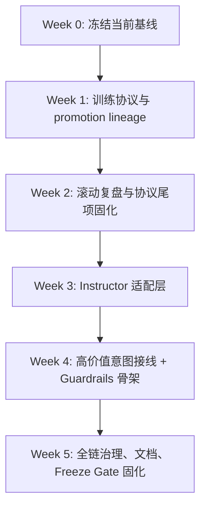

# v1.1 实施蓝图（2026-03-14，按当前仓库状态校正）

## 1. 版本定位

`v1.1` 的目标不是把系统包装成“更像人类基金经理的自主交易体”，而是把当前系统推进到一个更可信的状态：

- 对内：成为 **可信研究操作系统（trusted research OS）**
- 对外：仍然是 **受控的研究与训练系统**，不是可直接实盘托管资金的全自动引擎

本蓝图承接两份既有计划：

- [Agent Foundation Phased Implementation Plan](/Users/zhangsan/Desktop/投资进化系统v1.0/docs/archive/plans/AGENT_FOUNDATION_PHASED_IMPLEMENTATION_PLAN_20260313.md)
- [Phase 6 Structural Refactor Plan](/Users/zhangsan/Desktop/投资进化系统v1.0/docs/archive/plans/PHASE6_IMPLEMENTATION_PLAN_20260313.md)

但它已经根据当前仓库真实状态做了校正。现在的关键判断是：

1. 现有 `CommanderRuntime -> BrainRuntime -> InvestmentBodyService -> SelfLearningController` 主骨架应保留。
2. `v1.1` 的首要矛盾不是 “Agent 不够多”，而是 “训练协议、输出可靠性、执行治理不够硬”。
3. `Phase 6` 已不再是 `v1.1` 的待完成前置任务，而是 **已经基本完成的底座**。`v1.1` 应消费这些新接缝，而不是再把结构重构当主任务。

## 2. 这次扫描后确认的基线变化

### 2.1 已发生的系统性变化

最近几轮提交已经把仓库基线明显往前推了一大截：

- `Phase 6` 的 `Wave A-F` 已在 planning files 中被标记为完成，运行时、web、training、market data 的主要接缝已经建立。
- runtime human receipt/presentation 已从 `brain/runtime.py` 抽到 [brain/presentation.py](/Users/zhangsan/Desktop/投资进化系统v1.0/brain/presentation.py)。
- web contract/display helper 已沉到 [app/interfaces/web/presentation.py](/Users/zhangsan/Desktop/投资进化系统v1.0/app/interfaces/web/presentation.py) 和 [app/interfaces/web/contracts.py](/Users/zhangsan/Desktop/投资进化系统v1.0/app/interfaces/web/contracts.py)。
- `stock_analysis` 主链已经不再只靠旧的 [app/stock_analysis.py](/Users/zhangsan/Desktop/投资进化系统v1.0/app/stock_analysis.py)，而是出现了更明确的 [app/stock_analysis_services.py](/Users/zhangsan/Desktop/投资进化系统v1.0/app/stock_analysis_services.py)。
- 协议收敛已经开始落实到契约对象上：
  - [invest/contracts/agent_context.py](/Users/zhangsan/Desktop/投资进化系统v1.0/invest/contracts/agent_context.py) 已有 `confidence` 和 `effective_confidence()`
  - [invest/contracts/stock_summary.py](/Users/zhangsan/Desktop/投资进化系统v1.0/invest/contracts/stock_summary.py) 已把 `StockSummaryView` 变成默认摘要协议
- `pre-v1.1 cleanup gate` 已启动并推进，静默异常、观测与低风险兼容壳已经清掉一批。

### 2.2 对实施计划的直接影响

这意味着旧版蓝图里有三处已经过时：

1. 不能再把“`Phase 6` 最小必要结构解耦”当成 `v1.1` 的主模块之一。
2. `Instructor` 的接入点不能再只盯着 [brain/runtime.py](/Users/zhangsan/Desktop/投资进化系统v1.0/brain/runtime.py) 和旧 [app/stock_analysis.py](/Users/zhangsan/Desktop/投资进化系统v1.0/app/stock_analysis.py)，而应直接接到新的 presentation / service / contract seam 上。
3. `Guardrails` 的设计不能假设仓库还在大重构期，它现在应该建立在已经稳定下来的 protocol/task-bus/presentation 边界上。

## 3. 校正后的 v1.1 范围

### 3.1 In Scope

- 训练协议硬化与实验边界收紧
- 复盘/优化/候选配置的 lineage 和 promotion 纪律
- 协议收敛的尾项固化与 cleanup gate 的 blocker-only 推进
- `Instructor` 的局部结构化输出接入
- `Guardrails` 的高风险写操作治理
- 对应的测试、观测指标和 release gate 更新

### 3.2 Out of Scope

- 再启动一轮以目录迁移为主的大规模结构重构
- `PySR` 正式接入主版本
- `E2B` 沙箱后端正式上线
- `Temporal` durable workflow 平台化
- Tick 级 / 分钟级事件驱动回测引擎重写
- 新引入大型 Agent orchestration 框架替换当前 runtime

### 3.3 版本通过标准

`v1.1` 结束时，应至少满足以下标准：

1. 训练实验具备明确的 `experiment spec / run context / promotion record`，而不是隐式状态拼接。
2. `ReviewMeeting` 不再只围绕单周期 `EvalReport` 做解释，而是明确消费滚动窗口事实。
3. 候选 YAML 配置、runtime overrides、active config 三者可区分、可追踪、不可静默混用。
4. 关键 LLM intent 已具备结构化输出适配和失败回退。
5. 高风险 mutating tools 在执行前具备可读的阻断/确认机制。
6. 新的 canonical contract surface 不再明显漂移：
   - `AgentContext.confidence / effective_confidence()`
   - `StockSummaryView`
   - `ask_stock` canonical payload sections

## 4. 修订后的工作流总图

## 5. 模块级实施清单

### 5.1 模块 A：训练协议与实验边界

**优先级：P0，最先动手**

**目标**

- 把当前“随机 cutoff + 运行时状态 + review 建议 + mutation 候选”这种松散闭环，收束成明确的实验协议
- 为后续 `Instructor` / `Guardrails` 建立稳定的训练链路契约

**先改哪些文件**

- [app/train.py](/Users/zhangsan/Desktop/投资进化系统v1.0/app/train.py)
- [app/training/cycle_services.py](/Users/zhangsan/Desktop/投资进化系统v1.0/app/training/cycle_services.py)
- [app/training/execution_services.py](/Users/zhangsan/Desktop/投资进化系统v1.0/app/training/execution_services.py)
- [app/training/review_stage_services.py](/Users/zhangsan/Desktop/投资进化系统v1.0/app/training/review_stage_services.py)
- [app/training/review_services.py](/Users/zhangsan/Desktop/投资进化系统v1.0/app/training/review_services.py)
- [app/training/controller_services.py](/Users/zhangsan/Desktop/投资进化系统v1.0/app/training/controller_services.py)
- [app/training/lifecycle_services.py](/Users/zhangsan/Desktop/投资进化系统v1.0/app/training/lifecycle_services.py)
- [app/training/runtime_hooks.py](/Users/zhangsan/Desktop/投资进化系统v1.0/app/training/runtime_hooks.py)
- [app/training/reporting.py](/Users/zhangsan/Desktop/投资进化系统v1.0/app/training/reporting.py)
- [app/training/optimization.py](/Users/zhangsan/Desktop/投资进化系统v1.0/app/training/optimization.py)
- [invest/meetings/review.py](/Users/zhangsan/Desktop/投资进化系统v1.0/invest/meetings/review.py)
- [invest/evolution/engine.py](/Users/zhangsan/Desktop/投资进化系统v1.0/invest/evolution/engine.py)
- [invest/evolution/mutators.py](/Users/zhangsan/Desktop/投资进化系统v1.0/invest/evolution/mutators.py)
- [docs/TRAINING_FLOW.md](/Users/zhangsan/Desktop/投资进化系统v1.0/docs/TRAINING_FLOW.md)

**建议新增文件**

- `app/training/experiment_protocol.py`
- `app/training/lineage_services.py`
- `app/training/promotion_services.py`
- `app/training/contracts.py`

**要落的行为变更**

1. 把 `ExperimentSpec` 从“临时配置字典”提升为正式协议对象，至少固定：
   - `seed`
   - `date_range`
   - `simulation_days`
   - `allowed_models`
   - `llm_mode`
   - `review_window`
   - `promotion_policy`
2. 在单次训练工件中显式记录：
   - `active_config_ref`
   - `candidate_config_ref`
   - `runtime_overrides`
   - `review_basis_window`
   - `fitness_source_cycles`
   - `promotion_decision`
3. 把“候选 YAML 配置已生成”和“active config 已接管”严格区分。
4. 在未通过 promotion gate 前，不允许 mutation 候选静默替换 active config。
5. 若短期内做不到 GA 个体与结果一一绑定，就明确把当前逻辑降级标注为 heuristic tuner，而不是伪装成严肃 evolutionary search。

**先补哪些测试**

- 扩展 [tests/test_training_controller_services.py](/Users/zhangsan/Desktop/投资进化系统v1.0/tests/test_training_controller_services.py)
- 扩展 [tests/test_training_optimization.py](/Users/zhangsan/Desktop/投资进化系统v1.0/tests/test_training_optimization.py)
- 扩展 [tests/test_research_training_feedback.py](/Users/zhangsan/Desktop/投资进化系统v1.0/tests/test_research_training_feedback.py)
- 扩展 [tests/test_lab_artifacts.py](/Users/zhangsan/Desktop/投资进化系统v1.0/tests/test_lab_artifacts.py)
- 新增 `tests/test_training_experiment_protocol.py`
- 新增 `tests/test_training_review_window.py`
- 新增 `tests/test_training_promotion_lineage.py`

**本模块验收标准**

- `ReviewMeeting` 的输入窗口不是单轮 `EvalReport`，而是明确的 rolling fact set
- 任何 mutation / review 调整都能追溯到来源周期与目标配置
- `training_runs` / `training_evals` 中可以区分 active 与 candidate
- `should_freeze()` 依赖的评估对象有可审计来源

### 5.2 模块 B：协议尾项固化与 Cleanup Gate

**优先级：P0，和模块 A 交叉推进**

**目标**

- 利用最近已经建立好的 contract / presentation / stock-analysis seam，把协议尾项真正收紧
- 把 cleanup gate 控制在“只清阻塞 v1.1 的问题”，避免再次演变成大规模整理工程

**先改哪些文件**

- [app/stock_analysis_services.py](/Users/zhangsan/Desktop/投资进化系统v1.0/app/stock_analysis_services.py)
- [invest/contracts/agent_context.py](/Users/zhangsan/Desktop/投资进化系统v1.0/invest/contracts/agent_context.py)
- [invest/contracts/stock_summary.py](/Users/zhangsan/Desktop/投资进化系统v1.0/invest/contracts/stock_summary.py)
- [brain/presentation.py](/Users/zhangsan/Desktop/投资进化系统v1.0/brain/presentation.py)
- [app/interfaces/web/presentation.py](/Users/zhangsan/Desktop/投资进化系统v1.0/app/interfaces/web/presentation.py)
- [app/interfaces/web/contracts.py](/Users/zhangsan/Desktop/投资进化系统v1.0/app/interfaces/web/contracts.py)
- [app/commander_support/presentation.py](/Users/zhangsan/Desktop/投资进化系统v1.0/app/commander_support/presentation.py)
- [app/commander_support/observability.py](/Users/zhangsan/Desktop/投资进化系统v1.0/app/commander_support/observability.py)
- [app/web_server.py](/Users/zhangsan/Desktop/投资进化系统v1.0/app/web_server.py)

**建议新增文件**

- 原则上不主动新增目录级抽象，优先利用现有 seam
- 若确实需要，仅新增：
  - `tests/test_protocol_tail_hardening.py`

**要落的行为变更**

1. 继续把稳定字段从隐式 `metadata.get(...)` 读取迁移到显式契约对象，但只做已经建立 canonical path 的部分。
2. 把 `ask_stock` 的 canonical payload 当成默认协议，兼容顶层字段只保留镜像职责。
3. presentation 相关变更只允许落在 `brain/presentation.py` 和 `app/interfaces/web/presentation.py`，不回流到 entrypoint。
4. cleanup 仅限：
   - 阻塞 `v1.1` 的静默失败
   - 阻塞 `Instructor` / `Guardrails` 接入的 contract 漂移
   - 低风险、可证明安全的 import / global state 收口

**先补哪些测试**

- 扩展 [tests/test_ask_stock_model_bridge.py](/Users/zhangsan/Desktop/投资进化系统v1.0/tests/test_ask_stock_model_bridge.py)
- 扩展 [tests/test_v2_contracts.py](/Users/zhangsan/Desktop/投资进化系统v1.0/tests/test_v2_contracts.py)
- 扩展 [tests/test_research_contracts.py](/Users/zhangsan/Desktop/投资进化系统v1.0/tests/test_research_contracts.py)
- 扩展 [tests/test_observability_helpers.py](/Users/zhangsan/Desktop/投资进化系统v1.0/tests/test_observability_helpers.py)
- 扩展 [tests/test_agent_observability_contract.py](/Users/zhangsan/Desktop/投资进化系统v1.0/tests/test_agent_observability_contract.py)
- 扩展 [tests/test_architecture_import_rules.py](/Users/zhangsan/Desktop/投资进化系统v1.0/tests/test_architecture_import_rules.py)

**本模块验收标准**

- canonical contract surface 不再明显漂移
- `ask_stock`、brain human receipt、web display payload 都有稳定 shape
- cleanup 没有扩张成新一轮大重构

### 5.3 模块 C：Instructor 结构化输出层

**优先级：P1，建立在模块 A/B 稳定后**

**目标**

- 给关键 intent 加上 schema-first 的结构化输出、校验、重试和回退
- 直接利用最近已经建立好的 service / presentation / contract seam

**先改哪些文件**

- [app/llm_gateway.py](/Users/zhangsan/Desktop/投资进化系统v1.0/app/llm_gateway.py)
- [brain/runtime.py](/Users/zhangsan/Desktop/投资进化系统v1.0/brain/runtime.py)
- [brain/presentation.py](/Users/zhangsan/Desktop/投资进化系统v1.0/brain/presentation.py)
- [app/runtime_contract_tools.py](/Users/zhangsan/Desktop/投资进化系统v1.0/app/runtime_contract_tools.py)
- [app/stock_analysis_services.py](/Users/zhangsan/Desktop/投资进化系统v1.0/app/stock_analysis_services.py)
- [app/interfaces/web/presentation.py](/Users/zhangsan/Desktop/投资进化系统v1.0/app/interfaces/web/presentation.py)
- [config/control_plane.py](/Users/zhangsan/Desktop/投资进化系统v1.0/config/control_plane.py)

**建议新增文件**

- `brain/structured_output.py`
- `brain/response_models.py`
- `tests/test_structured_output_adapter.py`

**首批只接这些路径**

- `invest_ask_stock`
- `invest_training_plan_create`
- `invest_training_plan_execute` 的执行总结
- `invest_control_plane_update` 的确认前说明
- `BrainRuntime` 最终 receipt / bounded summary

**先补哪些测试**

- 扩展 [tests/test_brain_runtime.py](/Users/zhangsan/Desktop/投资进化系统v1.0/tests/test_brain_runtime.py)
- 扩展 [tests/test_schema_contracts.py](/Users/zhangsan/Desktop/投资进化系统v1.0/tests/test_schema_contracts.py)
- 扩展 [tests/test_commander_transcript_golden.py](/Users/zhangsan/Desktop/投资进化系统v1.0/tests/test_commander_transcript_golden.py)
- 扩展 [tests/test_commander_direct_planner_golden.py](/Users/zhangsan/Desktop/投资进化系统v1.0/tests/test_commander_direct_planner_golden.py)
- 扩展 [tests/test_stock_analysis_react.py](/Users/zhangsan/Desktop/投资进化系统v1.0/tests/test_stock_analysis_react.py)
- 扩展 [tests/test_ask_stock_model_bridge.py](/Users/zhangsan/Desktop/投资进化系统v1.0/tests/test_ask_stock_model_bridge.py)
- 新增 `tests/test_structured_output_adapter.py`

**本模块验收标准**

- 控制面开关关闭时无回归
- 目标 intent 的结构化输出成功率显著提高
- 失败时能返回明确错误或 fallback，不允许 silently degrade
- 不把展示逻辑重新塞回 `brain/runtime.py` 或 `app/web_server.py`

### 5.4 模块 D：Guardrails 治理层

**优先级：P1，在 Instructor 稳住后接入**

**目标**

- 把当前“参数 schema 校验 + confirm 语义”升级为“业务语义阻断 + 可读风险提示”
- 建立在已经稳定下来的 protocol/task-bus/presentation 边界上

**先改哪些文件**

- [brain/runtime.py](/Users/zhangsan/Desktop/投资进化系统v1.0/brain/runtime.py)
- [brain/tools.py](/Users/zhangsan/Desktop/投资进化系统v1.0/brain/tools.py)
- [app/commander.py](/Users/zhangsan/Desktop/投资进化系统v1.0/app/commander.py)
- [app/interfaces/web/contracts.py](/Users/zhangsan/Desktop/投资进化系统v1.0/app/interfaces/web/contracts.py)
- `brain/task_bus.py`
- [config/control_plane.py](/Users/zhangsan/Desktop/投资进化系统v1.0/config/control_plane.py)

**建议新增文件**

- `brain/guardrails.py`
- `brain/guardrails_policies.py`
- `tests/test_guardrails_policies.py`

**首批只守这些工具**

- `invest_control_plane_update`
- `invest_runtime_paths_update`
- `invest_evolution_config_update`
- `invest_training_plan_create`
- `invest_training_plan_execute`
- `invest_data_download`

**先补哪些测试**

- 扩展 [tests/test_commander_mutating_workflow_golden.py](/Users/zhangsan/Desktop/投资进化系统v1.0/tests/test_commander_mutating_workflow_golden.py)
- 扩展 [tests/test_commander_agent_validation.py](/Users/zhangsan/Desktop/投资进化系统v1.0/tests/test_commander_agent_validation.py)
- 扩展 [tests/test_brain_runtime.py](/Users/zhangsan/Desktop/投资进化系统v1.0/tests/test_brain_runtime.py)
- 扩展 [tests/test_training_plan_llm_policy.py](/Users/zhangsan/Desktop/投资进化系统v1.0/tests/test_training_plan_llm_policy.py)
- 新增 `tests/test_guardrails_policies.py`

**本模块验收标准**

- 危险 patch、不完整 plan、缺失 confirm 的高风险执行请求会被阻断
- 阻断原因能通过 protocol payload 明确表达
- 只读链路时延和输出不明显恶化

### 5.5 模块 E：观测、发布门与文档

**优先级：P1，贯穿全程**

**目标**

- 把 `v1.1` 新增的能力纳入 release gate，而不是靠人工记忆
- 让文档描述与当前实现基线重新对齐

**先改哪些文件**

- [app/freeze_gate.py](/Users/zhangsan/Desktop/投资进化系统v1.0/app/freeze_gate.py)
- [docs/MAIN_FLOW.md](/Users/zhangsan/Desktop/投资进化系统v1.0/docs/MAIN_FLOW.md)
- [docs/TRAINING_FLOW.md](/Users/zhangsan/Desktop/投资进化系统v1.0/docs/TRAINING_FLOW.md)
- [brain/presentation.py](/Users/zhangsan/Desktop/投资进化系统v1.0/brain/presentation.py)
- [app/interfaces/web/presentation.py](/Users/zhangsan/Desktop/投资进化系统v1.0/app/interfaces/web/presentation.py)
- 相关 `tests/test_*golden.py`

**建议新增指标**

- structured output success rate
- validation failure rate
- guardrails block rate
- candidate promotion attempt count
- active/candidate drift count
- canonical payload drift count

**先补哪些测试**

- 扩展 [tests/test_runtime_api_contract.py](/Users/zhangsan/Desktop/投资进化系统v1.0/tests/test_runtime_api_contract.py)
- 扩展 [tests/test_runtime_contract_generation.py](/Users/zhangsan/Desktop/投资进化系统v1.0/tests/test_runtime_contract_generation.py)
- 扩展 [tests/test_lab_artifacts.py](/Users/zhangsan/Desktop/投资进化系统v1.0/tests/test_lab_artifacts.py)
- 扩展 [tests/test_schema_contracts.py](/Users/zhangsan/Desktop/投资进化系统v1.0/tests/test_schema_contracts.py)
- 扩展 [tests/test_web_server_contract_headers.py](/Users/zhangsan/Desktop/投资进化系统v1.0/tests/test_web_server_contract_headers.py)

**本模块验收标准**

- `python -m app.freeze_gate --mode quick` 能覆盖 `v1.1` 新能力的关键路径
- 文档与真实实现不再明显脱节
- contract/presentation helper 的边界不回退

## 6. 测试实施顺序

`v1.1` 不建议“先写代码再补测试”，建议按下面顺序推进：

### 第一批：先冻结当前基线

- [tests/test_training_controller_services.py](/Users/zhangsan/Desktop/投资进化系统v1.0/tests/test_training_controller_services.py)
- [tests/test_training_optimization.py](/Users/zhangsan/Desktop/投资进化系统v1.0/tests/test_training_optimization.py)
- [tests/test_lab_artifacts.py](/Users/zhangsan/Desktop/投资进化系统v1.0/tests/test_lab_artifacts.py)
- [tests/test_v2_contracts.py](/Users/zhangsan/Desktop/投资进化系统v1.0/tests/test_v2_contracts.py)
- [tests/test_ask_stock_model_bridge.py](/Users/zhangsan/Desktop/投资进化系统v1.0/tests/test_ask_stock_model_bridge.py)
- [tests/test_observability_helpers.py](/Users/zhangsan/Desktop/投资进化系统v1.0/tests/test_observability_helpers.py)
- [tests/test_brain_runtime.py](/Users/zhangsan/Desktop/投资进化系统v1.0/tests/test_brain_runtime.py)
- [tests/test_commander_mutating_workflow_golden.py](/Users/zhangsan/Desktop/投资进化系统v1.0/tests/test_commander_mutating_workflow_golden.py)
- [tests/test_schema_contracts.py](/Users/zhangsan/Desktop/投资进化系统v1.0/tests/test_schema_contracts.py)

### 第二批：为 v1.1 新能力补新测试文件

- `tests/test_training_experiment_protocol.py`
- `tests/test_training_review_window.py`
- `tests/test_training_promotion_lineage.py`
- `tests/test_structured_output_adapter.py`
- `tests/test_guardrails_policies.py`

### 第三批：补 Golden、契约和发布门

- [tests/test_commander_transcript_golden.py](/Users/zhangsan/Desktop/投资进化系统v1.0/tests/test_commander_transcript_golden.py)
- [tests/test_commander_direct_planner_golden.py](/Users/zhangsan/Desktop/投资进化系统v1.0/tests/test_commander_direct_planner_golden.py)
- [tests/test_runtime_api_contract.py](/Users/zhangsan/Desktop/投资进化系统v1.0/tests/test_runtime_api_contract.py)
- [tests/test_runtime_contract_generation.py](/Users/zhangsan/Desktop/投资进化系统v1.0/tests/test_runtime_contract_generation.py)
- [tests/test_web_server_contract_headers.py](/Users/zhangsan/Desktop/投资进化系统v1.0/tests/test_web_server_contract_headers.py)

## 7. 每周推进方案（5 周 + Week 0 基线冻结）

### Week 0：冻结当前基线

**目标**

- 先把当前系统当作 `v1.1` 的真实起点冻结下来，不再把旧蓝图里的结构前置任务重复规划

**交付**

- 记录 Phase 6 已完成、protocol convergence 已推进、cleanup gate 已启动这三个前提
- 跑一轮基线回归并固定为新起点

**建议验证**

- `pytest -q tests/test_training_controller_services.py tests/test_v2_contracts.py tests/test_ask_stock_model_bridge.py tests/test_brain_runtime.py`
- `python -m app.freeze_gate --mode quick`

### Week 1：训练协议与 Promotion Lineage

**目标**

- 建立 `ExperimentSpec / RunContext / PromotionRecord` 骨架

**交付**

- `ExperimentSpec / RunContext` 初版
- `active / candidate / runtime override` 三分语义
- 新测试骨架：
  - `test_training_experiment_protocol.py`
  - `test_training_promotion_lineage.py`

**建议验证**

- `pytest -q tests/test_training_controller_services.py tests/test_training_experiment_protocol.py tests/test_lab_artifacts.py`
- `ruff check .`
- `pyright .`

### Week 2：滚动复盘与协议尾项固化

**目标**

- 让 review 真正基于滚动窗口
- 固化 canonical contract surface

**交付**

- `ReviewMeeting` 输入改为 rolling fact set
- `fitness_source_cycles` 与 mutation meta 入工件
- `test_training_review_window.py` 落地
- `ask_stock` / `AgentContext` / `StockSummaryView` 的尾项协议确认

**建议验证**

- `pytest -q tests/test_training_review_window.py tests/test_training_optimization.py tests/test_research_training_feedback.py tests/test_v2_contracts.py tests/test_ask_stock_model_bridge.py`
- `python -m app.freeze_gate --mode quick`

### Week 3：Instructor 适配层

**目标**

- 建立统一 structured output adapter，不做全局替换

**交付**

- `brain/structured_output.py`
- 控制面 feature flags 初版
- `invest_ask_stock` 与 `training_plan_create` 的 schema 模型草案
- 新 seam 上的 presentation 输出模型

**建议验证**

- `pytest -q tests/test_structured_output_adapter.py tests/test_brain_runtime.py tests/test_schema_contracts.py`
- `ruff check .`

### Week 4：高价值意图接线 + Guardrails 骨架

**目标**

- 把结构化输出接进高价值链路
- 同时建立 Guardrails 的最小骨架

**交付**

- `invest_training_plan_execute` 总结输出接线
- `invest_control_plane_update` 确认前说明接线
- `brain/guardrails.py` 和首批 policy 框架
- golden 更新第一轮

**建议验证**

- `pytest -q tests/test_commander_transcript_golden.py tests/test_commander_direct_planner_golden.py tests/test_stock_analysis_react.py tests/test_guardrails_policies.py`
- `python -m app.freeze_gate --mode quick`

### Week 5：治理收口、发布门与文档冻结

**目标**

- 把 `v1.1` 的文档、contract、gate、golden 和治理逻辑收口

**交付**

- Guardrails 首批 6 个 mutating tools 落地
- `MAIN_FLOW.md` / `TRAINING_FLOW.md` 更新
- `freeze_gate.py` 扩容
- 全链 quick/full regression 通过

**建议验证**

- `pytest -q`
- `python -m app.freeze_gate --mode quick`
- `python -m app.freeze_gate --mode full`

## 8. 执行约束

### 8.1 必须坚持的约束

- 默认保持 feature flag 关闭
- 任何新能力必须 opt-in
- 不允许在 `v1.1` 再启动一轮新的 Phase 6 级重构
- 不允许把未验证的 candidate config 自动包装成“已经进化成功”
- presentation 逻辑不能回流到 entrypoint
- cleanup 只允许 blocker-driven，不允许扩散成版本主任务

### 8.2 版本内的 Go / No-Go 判断

如果 Week 2 结束时下面三件事仍没做成，建议暂停 `Instructor` 接入，先补训练协议：

1. `ReviewMeeting` 仍是单周期事实输入
2. active / candidate / runtime override 仍无法稳定区分
3. canonical payload surface 仍明显漂移

如果 Week 4 结束时下面两件事仍没做成，建议暂停 `Guardrails` 扩围，先收缩范围：

1. structured output adapter 还不稳定
2. golden 回归成本明显失控

## 9. v1.1 结束后的自然延伸

`v1.1` 完成后，才建议进入 `v1.2` 的以下方向：

- `PySR`：离线 Training Lab 符号回归支线
- `E2B`：隔离执行后端
- `Temporal`：仅在长任务痛点真实出现后评估

在 `v1.1` 之前，不建议把这些方向掺进主链。

## 10. 一页结论

扫描当前系统之后，`v1.1` 的实质已经变成：

- 不再补结构性前置条件
- 直接利用已经完成的接缝
- 优先把训练实验做硬
- 再把 LLM 输出做成契约
- 最后把高风险操作做成受控系统

这比旧版蓝图更贴近仓库现实，也更适合你现在这条主线。
