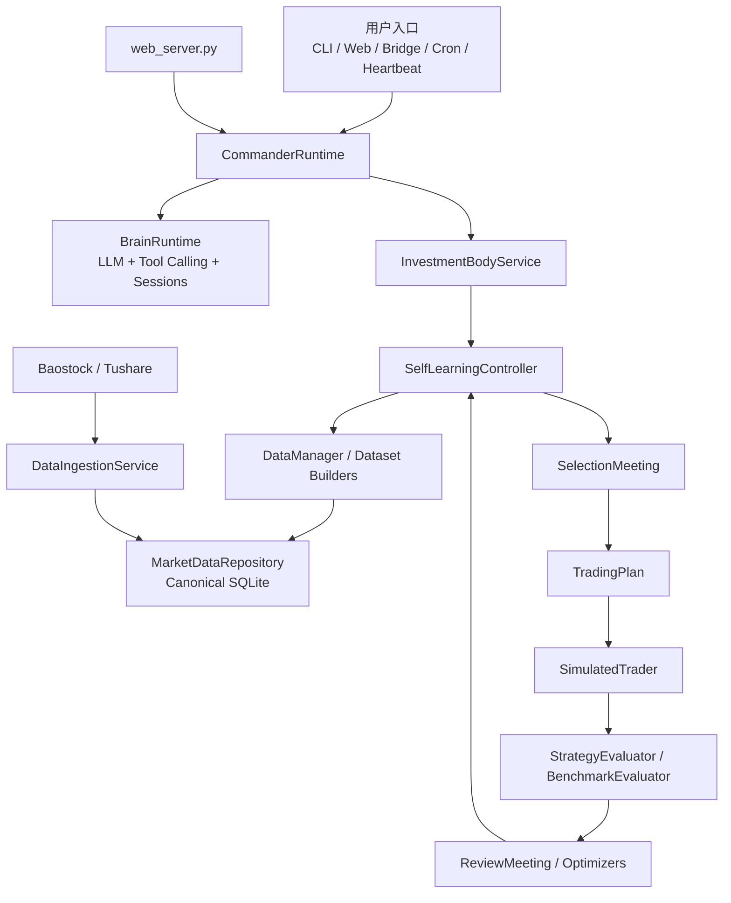
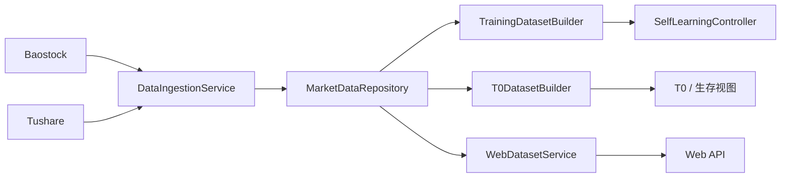
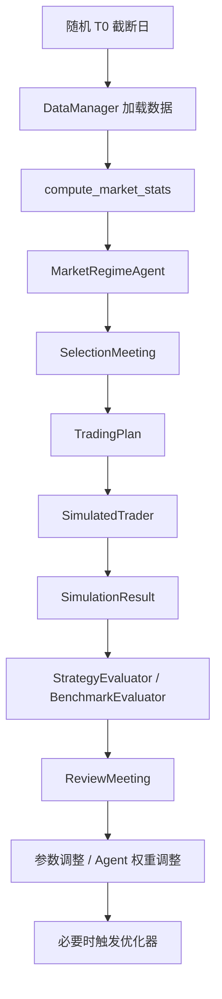
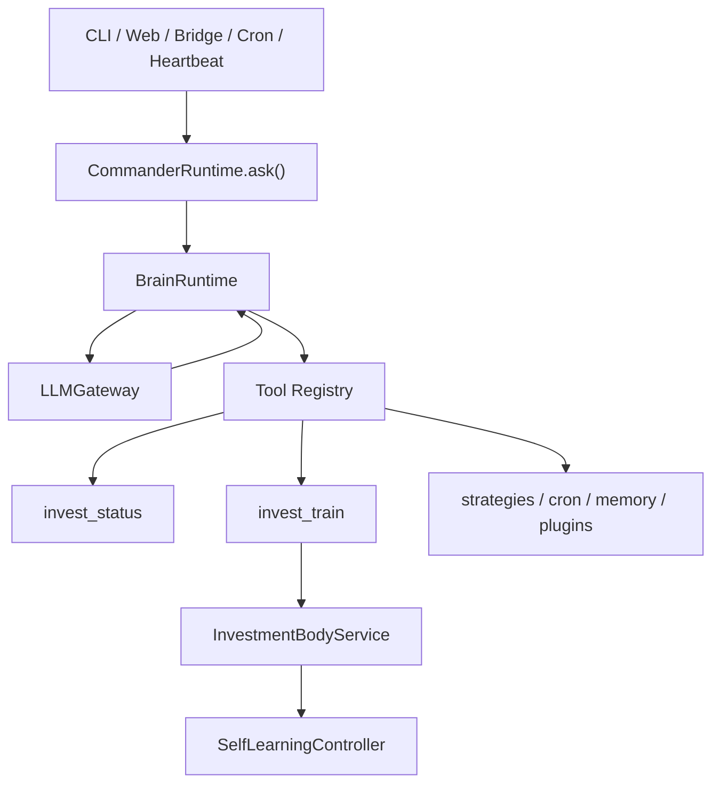

# 项目审计报告（2026-03-07）

## 1. 审计背景

本次审计基于 2026 年 3 月 7 日项目代码现状，对系统进行了结构化梳理与风险评估，覆盖以下范围：

- 数据获取、整理、清洗与统一数据层
- 训练主流程、交易执行与评估优化链路
- Agent 调度流程与 Commander / Brain / Web 运行链路
- 功能模块职责边界、运行方式、结构性风险与下一步治理建议

本报告基于当前仓库已清理后的状态编写，重点不再是“遗留兼容清理”，而是“当前架构是否清晰、可维护、可扩展、可治理”。

## 2. 结论摘要

### 2.1 总体判断

当前项目已经明显脱离“脚本堆叠”的早期状态，基本形成了以下四层结构：

1. 入口层：`app/commander.py`、`app/train.py`、`app/web_server.py`
2. 运行时层：`brain/`、`CommanderRuntime`
3. 数据层：`market_data/`
4. 业务层：`invest/`

整体方向正确，且前期清理工作已经取得明显成效：

- 数据链路已基本统一到 canonical schema + repository + dataset builder 模型
- 训练闭环已清晰收敛为“会议生成计划 → Trader 执行 → Review 复盘 → Optimizer 优化”
- Web 层已保持薄壳，不再复制核心业务逻辑
- Runtime 与历史归档已被隔离到独立目录，仓库整洁度显著提升

### 2.2 当前最健康的部分

- 统一数据层设计
- 训练主闭环的职责边界
- 决策与执行分离的交易模型
- Commander 统一编排模式

### 2.3 当前最需要继续治理的部分

当前最需要解决的已经不是“目录混乱”或“旧链路未删干净”，而是运行边界治理：

- 并发运行与单实例约束
- 训练触发互斥
- fallback 可观测性
- 配置修改的治理与审计
- 优化器触发边界与状态追踪

---

## 3. 当前架构总览

### 3.1 主入口

当前系统有三条正式入口：

- `app/commander.py`：统一 CLI / Daemon / Runtime 装配入口
- `app/train.py`：训练/研究专用入口
- `app/web_server.py`：Flask API / 前端入口

这三条入口已经基本做到：

- 不再各自维护独立业务实现
- 共享同一套数据层与训练内核
- Web 层主要调用 Commander Runtime，不形成第二套系统

### 3.2 分层关系

- `brain/`：本地 agent runtime、tool registry、scheduler、bridge、memory
- `market_data/`：数据同步、仓储、数据读取构建器、质量检查
- `invest/`：市场分析、选股、会议、交易、评估、优化
- `app/commander.py`：负责把 `brain/` 与 `invest/` 统一装配成一个运行时

这意味着当前项目已经具备“技术运行时”和“投资业务内核”的清晰分层。

---

## 4. 数据流审计

## 4.1 当前数据获取方式

当前数据获取已经统一到 `market_data/ingestion.py`：

- `DataIngestionService.sync_security_master()`：同步证券主数据
- `DataIngestionService.sync_daily_bars()`：从 Baostock 同步日线
- `DataIngestionService.sync_daily_bars_from_tushare()`：从 Tushare 进行补充同步

也就是说，当前“事实数据写入”的标准入口已经不是旧脚本，而是统一 ingest service。

## 4.2 当前数据存储方式

当前 canonical 存储落在 SQLite，由 `MarketDataRepository` 负责：

- `security_master`
- `daily_bar`
- `financial_snapshot`
- `ingestion_meta`

这套 schema 是目前训练、Web、T0 数据视图的统一事实来源。

## 4.3 当前数据整理与清洗方式

当前项目的数据清洗不是靠一个“清洗大脚本”完成，而是分散在以下几个层面：

### 写入侧

- 将 Baostock / Tushare 字段映射为 canonical 字段名
- 统一日期格式
- 统一 `adj_flag` / `source` 等元数据
- 用 upsert 语义写入 SQLite

### 读取侧

- `normalize_stock_frame()` 统一列顺序、类型、日期字段、计算缺失 `pct_chg`
- `TrainingDatasetBuilder` 负责训练集切片
- `T0DatasetBuilder` 负责 T0 视角数据
- `WebDatasetService` 负责面向 Web 的只读查询

### 外层协调

- `DataManager` 作为 façade，优先离线库，其次在线数据，最后 mock

## 4.4 数据流现状图

## 4.5 数据层优点

- 已有统一事实源，避免各入口各自取数
- canonical schema 已经足够明确
- 训练/Web/T0 已共用同一仓储模型
- 写路径和读路径已经初步分离

## 4.6 数据层问题

### 问题 1：`DataManager` 仍承担过多职责

它当前同时做：

- 数据源选择
- 离线优先判断
- 在线兜底
- mock 兜底

这会让数据入口“太方便”，但边界不够硬。

### 问题 2：真实数据失效可能被 mock 掩盖

这提高了可运行性，但降低了运行透明度：

- 训练能继续跑
- 但不一定跑在真实数据上
- 使用者不一定第一时间感知链路已退化

### 问题 3：数据同步与数据质量巡检仍偏弱耦合

当前有质量层，但还缺少“同步完成后自动质量判定 + 状态落盘 + 前端提示”的完整治理闭环。

---

## 5. 训练流程审计

## 5.1 训练主链路

当前训练主链路在 `SelfLearningController.run_training_cycle()` 中已经非常清晰，可抽象为：

1. 随机生成 T0 截断日期
2. 加载训练所需股票数据
3. 计算市场统计与市场状态
4. 进入选股会议
5. 输出统一 `TradingPlan`
6. `SimulatedTrader` 执行模拟交易
7. 记录交易结果与每日净值
8. 执行收益评估与基准评估
9. 触发复盘会议
10. 根据复盘结果调整参数与 agent 权重
11. 必要时触发优化器

## 5.2 当前训练流架构图

## 5.3 训练设计的优点

### 优点 1：决策与执行分离

Agent 不直接交易，而是先生成 `TradingPlan`，再交给 `SimulatedTrader` 执行。这保证了：

- 决策可解释
- 执行可复现
- 交易风控统一归口
- 后续审计更容易

### 优点 2：T0 边界清楚

训练中显式区分：

- 截断日前可用于判断的数据
- 截断日后用于回测模拟的数据

这对避免未来函数泄漏非常重要。

### 优点 3：训练闭环完整

系统不只是“选股 + 回测”，而是具备完整闭环：

- 选股
- 执行
- 评估
- 复盘
- 参数更新
- 进化优化

## 5.4 训练流程问题

### 问题 1：fallback 太强，掩盖 Agent 真能力

当前系统为了保证训练不空转，在多个点做了降级：

- 会议失败时退化到 `_run_algorithm()`
- 未选出股票时回退到 `AdaptiveSelector + make_simple_plan()`

这会造成一个典型问题：

- 表面上训练一直成功跑完
- 但结果可能并不是 Agent 驱动出来的
- 进而降低 Agent 效能问题的暴露速度

### 问题 2：优化层组件过多

当前至少有以下优化/评估模块并存：

- `LLMOptimizer`
- `EvolutionEngine`
- `StrategyEvolutionOptimizer`
- `StrategyEvaluator`
- `BenchmarkEvaluator`
- `FreezeEvaluator`

这些能力本身不是坏事，但触发边界和输入输出边界需要更清楚，否则后续会出现：

- 参数到底是谁改的？
- 这次调整是复盘决策，还是优化器进化，还是 benchmark 门控？
- 当前参数是“实验参数”还是“冻结参数”？

### 问题 3：长期运行产物较多

训练相关的会议记录、评估记录、cycle 结果已经比较完整，但“状态文件”和“审计归档文件”之间还需要继续分层。

---

## 6. Agent 调度与运行时审计

## 6.1 两种 Agent 概念已经分离

当前项目有两套不同含义的 Agent：

### 业务 Agent

定义在 `invest/agents.py` 中：

- `MarketRegimeAgent`
- `TrendHunterAgent`
- `ContrarianAgent`
- `StrategistAgent`
- `ReviewDecisionAgent`
- `EvoJudgeAgent`

它们负责策略理解、选股判断、复盘建议，不直接承担系统调度。

### 运行时 Agent

定义在 `brain/runtime.py` 的 `BrainRuntime` 中，负责：

- 多轮对话
- tool calling
- session 管理
- system prompt 注入
- 将自然语言请求转换成系统工具调用

这两层已经实现了解耦，这是当前架构的重要进步。

## 6.2 Commander 调度链路

当前 Commander 运行时链路为：

1. `CommanderRuntime` 装配 Brain / Body / Scheduler / Bridge / Memory / Plugins
2. 外部请求进入 `ask()`
3. `BrainRuntime` 调用统一 `LLMGateway`
4. 模型如果发出 tool calls，则进入工具执行
5. 工具最终调用状态查询、训练、策略加载、记忆检索、调度等系统功能

## 6.3 当前运行时架构图

## 6.4 当前运行时优点

### 优点 1：入口统一

CLI、Web、Bridge、Cron、Heartbeat 最终都可以收敛到 Commander Runtime，不再各自拼装第二套逻辑。

### 优点 2：LLM 出口统一

训练侧与运行时侧都通过统一 LLM 通道工作，避免不同模块各自接第三方模型接口。

### 优点 3：Tool Calling 已较标准化

`BrainRuntime` 已具备完整 tool-calling 主循环：

- 构造消息
- 调用 LLM
- 读取 tool calls
- 校验参数
- 执行工具
- 回写结果
- 再次迭代

### 优点 4：已修复工具参数静默吞错问题

此前评审发现 `_parse_tool_args()` 会在 JSON 失败时悄悄返回空参数，存在风险。当前这一点已经修复为显式抛出结构化错误，并回送给循环，方向正确。

## 6.5 运行时问题

### 问题 1：缺少单实例治理

当前 Web 与 CLI 若同时启动，可能共享并发写入：

- `runtime/state`
- `runtime/memory`
- `runtime/sessions`
- cron store
- bridge inbox/outbox

这会造成运行态相互覆盖或状态不一致。

### 问题 2：训练缺少互斥门控

当前多个入口都可触发训练，但缺少明显的：

- 训练执行锁
- 队列化执行机制
- 重入保护
- 冲突提示

### 问题 3：配置链路仍然偏弱治理

当前 Web 已可修改配置并写回 `config/evolution.yaml`，这是可用的，但仍有以下风险：

- 缺少版本化配置快照
- 缺少变更记录
- 缺少失败回滚
- 缺少“本次训练实际使用的是哪份配置”的冻结引用

---

## 7. 功能模块运转流程审计

## 7.1 模块职责

### `market_data/`

职责：事实数据平台。

不应承担：策略判断、交易执行、LLM 推理。

### `invest/`

职责：投资业务逻辑。

包括：市场判断、选股、会议、交易、评估、优化。

### `brain/`

职责：运行时交互框架。

包括：tool-calling、scheduler、bridge、memory、plugin。

### `app/commander.py`

职责：统一装配与调度入口。

### `app/web_server.py`

职责：对外 UI/API 访问面。

## 7.2 当前职责边界是否清晰

总体上，已经比历史版本清晰很多：

- 数据归数据层
- 业务归业务层
- 运行时归 runtime 层
- 对外接口归 Web / CLI 入口

但仍有两个边界可继续增强：

1. `DataManager` 作为 façade 的职责还可以再收紧
2. 配置管理与运行状态治理仍部分散落在入口层

---

## 8. 风险分级

## 8.1 P0 风险

### P0-1 并发运行状态冲突

若 Web 与 CLI 同时运行两个 runtime 实例，当前缺少显式锁机制，可能导致：

- 状态覆盖
- memory 竞争写入
- 调度状态竞争
- bridge 处理混乱

### P0-2 训练重入与互斥缺失

当前多入口都可以触发训练，但没有统一执行门控。

### P0-3 fallback 可观测性不足

系统虽然能持续运行，但无法快速区分：

- Agent 真实产出
- 会议算法降级产出
- mock 数据产出
- 在线/离线数据切换产出

## 8.2 P1 风险

### P1-1 配置治理弱

配置可修改，但缺少审计、版本和回滚机制。

### P1-2 优化器触发边界不清

多种优化器并存，长期维护成本会上升。

### P1-3 运行态文档仍不够细

`runtime/` 中的文件与目录虽然已隔离，但还缺一份非常明确的“生命周期说明”。

## 8.3 P2 风险

### P2-1 优化层心智负担偏高

对新同事或未来维护者而言，`invest/optimization.py` 与 `invest/evaluation.py` 的理解门槛仍然偏高。

---

## 9. 下一步完整优化建议方案

以下方案以“不改变当前系统功能语义、优先增强治理与可维护性”为原则。

## Phase A：运行治理加固（最高优先级）

### 目标

把系统从“结构干净”推进到“运行可靠”。

### 建议项

1. 增加 runtime 单实例锁
   - 在 `runtime/` 下建立实例锁文件
   - CLI / Web 启动时先检测锁
   - 冲突时给出明确提示，而不是继续启动

2. 增加训练执行互斥锁
   - `train_once()`、Web 训练接口、cron 训练触发统一走同一把锁
   - 训练中再次请求训练时返回“已有任务执行中”

3. 增加运行状态枚举
   - `idle`
   - `training`
   - `syncing_data`
   - `reloading_strategies`
   - `error`

4. 在 `state` 中显式记录当前任务
   - 任务来源：CLI / Web / Cron / Bridge / Heartbeat
   - 开始时间
   - 结束时间
   - 成功/失败状态
   - 最近错误摘要

### 预期收益

- 避免双实例互踩
- 避免训练重入
- 降低线上运行不确定性
- 为后续 Web 展示和运维观察打基础

## Phase B：训练审计增强（最高优先级）

### 目标

让训练结果“可解释、可追责、可分析”。

### 建议项

1. 在每个 `cycle_result` 中补充审计标签
   - `data_mode`: `offline` / `online` / `mock`
   - `selection_mode`: `meeting` / `meeting_fallback` / `algorithm`
   - `agent_used`: `true` / `false`
   - `llm_used`: `true` / `false`
   - `benchmark_passed`
   - `review_applied`

2. 将 fallback 明确写入日志与结果
   - 会议失败后是否使用算法兜底
   - 是否未能从离线库取数而转为在线 / mock
   - 是否发生参数自动调整

3. 增加训练运行摘要
   - 每轮训练结束输出统一 summary
   - Web / CLI / state file 展示相同结构

### 预期收益

- 能区分“系统能跑”和“Agent 真有效”
- 便于后续对 Agent、模型、数据链路做效果归因

## Phase C：配置治理统一

### 目标

把配置从“可修改”提升到“可治理”。

### 建议项

1. 建立统一配置服务层
   - Web 不直接散写 YAML
   - CLI / Web / Runtime 统一通过配置服务更新

2. 配置变更自动留痕
   - 时间
   - 操作来源
   - 修改字段
   - 修改前后值摘要

3. 训练运行冻结配置快照
   - 每个训练周期记录一份配置快照引用
   - 后续评估可以明确对应哪份配置

4. 增加配置校验与回滚
   - 保存前验证字段类型与边界
   - 保存失败自动回滚

### 预期收益

- 避免配置链路继续扩散
- 让训练结果具备“配置可追溯性”

## Phase D：优化层边界收口

### 目标

降低 `optimization.py` / `evaluation.py` 的心智负担。

### 建议项

1. 画出优化器触发矩阵
   - ReviewMeeting 触发什么
   - 连续亏损触发什么
   - Benchmark 不达标触发什么
   - FreezeEvaluator 触发什么

2. 明确三类调整来源
   - 复盘建议调整
   - 规则型自动调整
   - 演化型优化调整

3. 将“建议”和“已应用”分离
   - suggestion
   - decision
   - applied_change

4. 为优化层增加统一结果对象
   - 谁触发的
   - 为什么触发
   - 输入是什么
   - 输出是什么
   - 是否实际生效

### 预期收益

- 降低维护成本
- 提升审计与回放能力
- 便于以后拆分优化器

## Phase E：数据治理闭环

### 目标

让数据同步从“能下载”升级为“有健康状态”。

### 建议项

1. 数据同步后自动触发质量检查
2. 将质量摘要写入 `ingestion_meta` 或 runtime state
3. Web 展示数据健康状态
   - 最近同步时间
   - 覆盖股票数量
   - 覆盖日期范围
   - 缺口检查结果
4. 明确在线 / mock 降级告警

### 预期收益

- 数据问题更早暴露
- 不再依赖人工猜测“训练为什么效果怪”

## Phase F：文档与运维说明收口

### 目标

把当前清理成果沉淀成长期可维护文档体系。

### 建议项

1. 增补“运行态设计说明”
2. 增补“训练审计字段说明”
3. 增补“配置治理说明”
4. 增补“优化器触发矩阵图”

### 预期收益

- 新同事上手更快
- 后续继续重构时不容易偏离当前架构主线

---

## 10. 建议实施顺序

推荐按以下顺序推进：

1. Phase A：运行治理加固
2. Phase B：训练审计增强
3. Phase C：配置治理统一
4. Phase D：优化层边界收口
5. Phase E：数据治理闭环
6. Phase F：文档与运维说明收口

这是因为：

- A/B 直接影响系统可靠性与可解释性
- C/D 影响长期维护成本
- E/F 影响稳定运营和团队协作效率

---

## 11. 审计最终判断

当前项目已经具备继续演进的良好基础，不建议再做无目标的大范围重排。下一阶段最优策略不是继续“机械瘦身”，而是：

- 固化当前主架构
- 治理运行边界
- 强化训练审计
- 收口配置与优化器边界

如果这四件事做完，这个项目会从“结构已经干净”进一步升级为“工程上可靠、策略上可审计、演进上可持续”的状态。

## 第四轮目录收口补充

- 顶层应用实现已收口到 `app/` 包。
- 根目录 `commander.py`、`train.py`、`web_server.py`、`llm_gateway.py`、`llm_router.py` 现为兼容壳或兼容转发模块。
