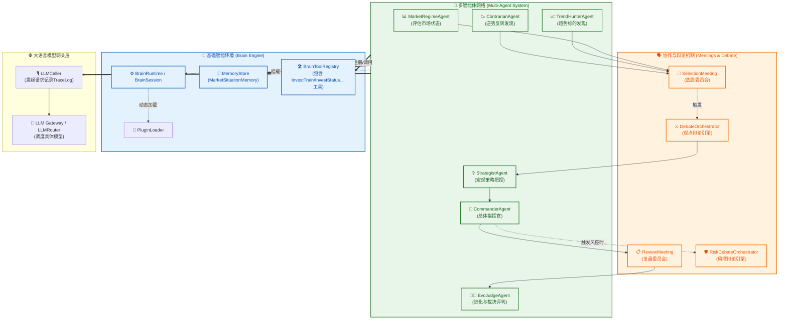
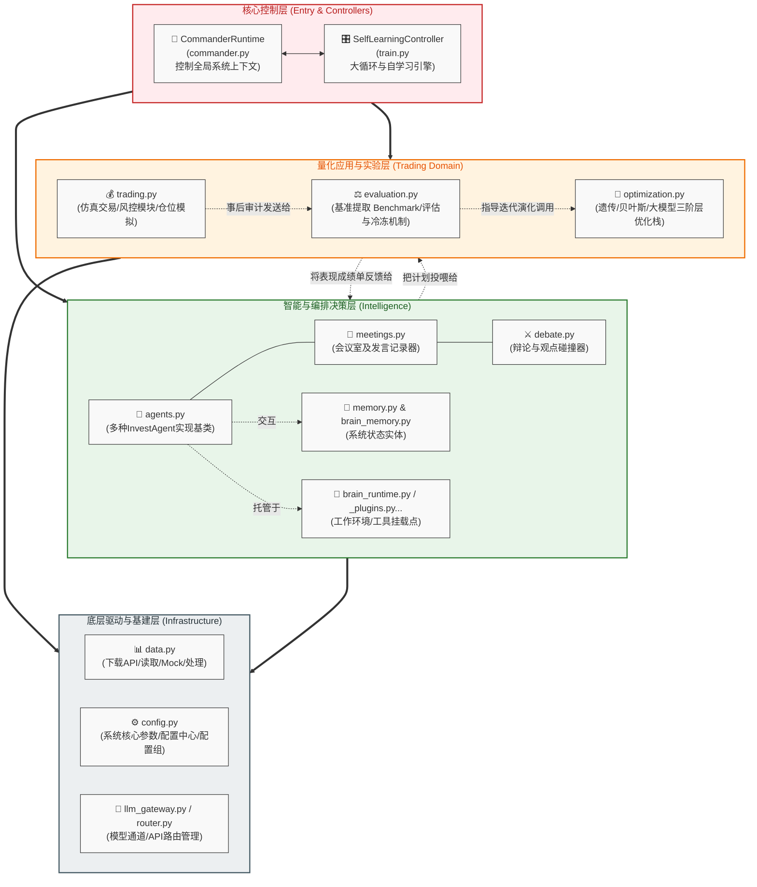

# 投资进化系统 v1.0 全局系统架构平面图

基于对项目当前真实代码（核心类名与逻辑关联）的深度扫描还原，本架构平面图从三个核心视角展示系统的设计与流转：

---

## 视图一：以 Agent 为核心的分工与协作视角

此视图详述以 Agent 为核心的**多智能体网络**，以及它们是如何通过底层大脑运行时（Brain Engine）、会议机制（Meetings & Debate）被调度，并获取大模型能力的。

---

## 视图二：以数据流为核心的流转视角

此视图刻画了系统一次完整的**“特征认知 -> 交易决策 -> 仿真回测 -> 优化冻结”**的数据流转闭环。

```mermaid
flowchart LR
    subgraph DataLoad ["1. 数据接入阶段 (Data Loader)"]
        direction TB
        SRC[("离线库 / Mock")] --> OFF["💾 OfflineDataLoader"]
        SRC2[("在线API源")] --> ONL["📡 DataDownloader"]
        MOCK["MockDataProvider"] -.可替代.-> OFF
        OFF & ONL --> DM["🗄️ DataManager"]
        DM --> T0["✂️ T0DataLoader<br/>(根据随机T0日截断)"]
    end

    subgraph SignalPlan ["2. 选股计划阶段 (Signal & Plan)"]
        direction TB
        T0 --> SEL["🎯 StockSelector / AdaptiveSelector"]
        SEL --> FACT["🔢 Alpha & Risk FactorModel"]
        FACT --> POOL["📥 CandidatePool"]
        POOL --> RANK["📈 DailyRanker"]
        RANK --> PLAN["📝 TradingPlan<br/>(拆分为 PositionPlan)"]
    end

    subgraph SimTrading ["3. 模拟执行阶段 (Trading Simulation)"]
        direction TB
        PLAN --> SCHED["⏰ TradingScheduler"]
        SCHED --> SIM["💰 SimulatedTrader"]
        SIM -.日级别风控拦截.-> RISK["🛡️ RiskController / DynamicStopLoss"]
        SIM --> REC["📜 TradeRecord / SimulationResult"]
    end

    subgraph EvalOpt ["4. 评估进化阶段 (Evaluation & Optimization)"]
        direction TB
        REC --> EVAL["⚖️ StrategyEvaluator<br/>(提取 BenchmarkMetrics)"]
        EVAL --> ANALYZE["📊 PerformanceAnalyzer / TradingAnalyzer"]
        ANALYZE --> OPT["🧬 核心 Optimizer<br/>(ThreeStage / Genetic / Bayesian)"]
        OPT --> LLMOPT["🧠 LLMOptimizer<br/>(大语言模型语义解析优化)"]
        LLMOPT --> FREEZE["❄️ FreezeEvaluator / ModelFreezer"]
    end
    
    subgraph Store ["5. 落盘固化 (Persistence)"]
        FREEZE ==满意==> REGISTRY["🧬 StrategyGeneRegistry<br/>(落盘为策略基因)"]
        FREEZE ==不满意==> LOVER["🔄 SelfLearningController<br/>(再次从随机T0开启周期)"]
    end

    DataLoad ==提供历史知识库==> SignalPlan
    SignalPlan ==提供待交易决策单==> SimTrading
    SimTrading ==提供运行仿真战绩单==> EvalOpt
    
    classDef loader fill:#f3e5f5,stroke:#7b1fa2,stroke-width:2px,color:#4a148c;
    classDef planner fill:#e8f5e9,stroke:#2e7d32,stroke-width:2px,color:#1b5e20;
    classDef trader fill:#fff3e0,stroke:#ef6c00,stroke-width:2px,color:#e65100;
    classDef eval fill:#e3f2fd,stroke:#1565c0,stroke-width:2px,color:#0d47a1;
    class DataLoad,DM,T0 loader;
    class SignalPlan,SEL,FACT,POOL,RANK,PLAN planner;
    class SimTrading,SCHED,SIM,RISK,REC trader;
    class EvalOpt,EVAL,ANALYZE,OPT,LLMOPT,FREEZE eval;
```

---

## 视图三：以模块和功能层级为核心的系统分层视角

此视图展现了项目源码中各 `.py` 文件模块的具体划分、调用及功能承载关系。

